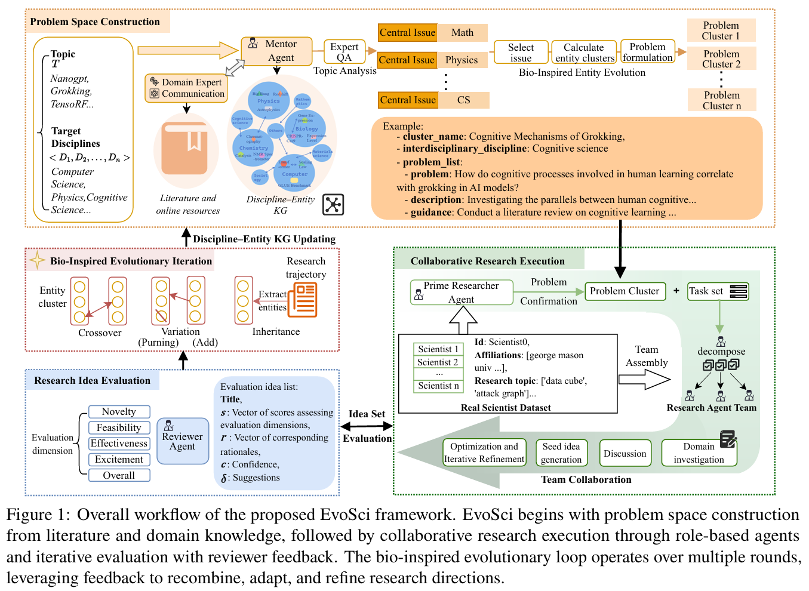
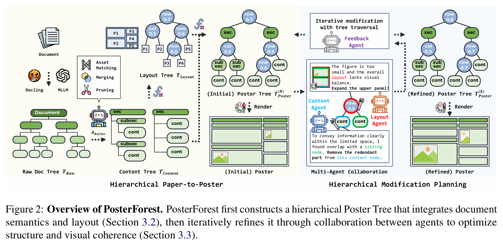
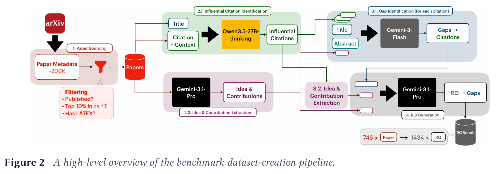
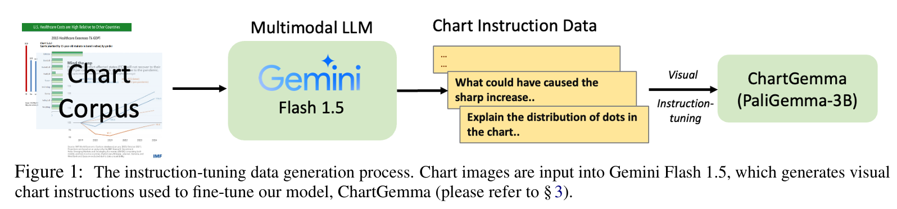
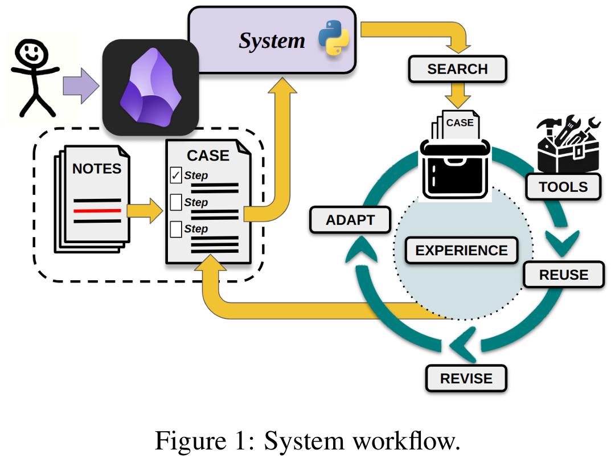

this is a test for a new file

<!--more-->

科研写作评估

idea生成

科研图表解读/生成

科研结论生成

## 2026

1. Xiaoyu Xiong, Yuqi Ren, and Deyi Xiong. 2026. EvoSci: A Bio-Inspired Multi-Agent Framework for the Evolution of Scientific Discovery. In *Proceedings of the 64th Annual Meeting of the Association for Computational Linguistics (Volume 1: Long Papers)*, pages 9846–9878, San Diego, California, United States. Association for Computational Linguistics. URL https://aclanthology.org/2026.acl-long.447/
   
   1. 大语言模型（LLM）在科学发现中展现出巨大潜力，但现有方法在科研工作流设计和多角色协作机制方面仍面临重大挑战。为缓解这些问题，我们提出了EvoSci，一种融合生物启发式进化与知识图谱建模的多智能体科学协作框架。EvoSci通过集成导师、研究员和审稿人等基于角色的多个智能体，迭代生成、评估并优化研究思路。结合协同推理、共享记忆和进化反馈机制，EvoSci显著提升了科学探索的一致性与创造性。在真实科研主题上的实验表明，EvoSci在基于LLM的结构化同行评审和比较排序评估中明显优于现有强基线模型，取得了最高的整体同行评审得分（ICLR 4.90）和最佳排名（Top-10 = 54）。这些结果表明，EvoSci在科学思想生成和持续发现方面均具有卓越优势。
   2. 
   
2. Choi, J., Park, S., Song, S., & Shim, H. (2026, July). Posterforest: Hierarchical multi-agent collaboration for scientific poster generation. In *Proceedings of the 64th Annual Meeting of the Association for Computational Linguistics (Volume 1: Long Papers)* (pp. 379-401). URL https://aclanthology.org/2026.acl-long.15.pdf

   1. 科学海报生成
   2. 自动化生成科学海报需要对文档进行层次化理解，并实现内容与布局的协调规划。现有方法通常依赖于扁平化的摘要，或分别优化内容与布局，因而常导致信息丢失、逻辑连贯性弱以及视觉平衡不佳。我们提出PosterForest，一种无需训练的科学海报生成框架。该方法引入了“海报树”（Poster Tree），这是一种结构化的中间表示形式，能够捕捉文档的层级结构以及多层级的图文语义关系。基于这一表示，内容与布局代理通过分层推理和递归优化，从整体架构到局部构图逐步完善海报设计。这种联合优化显著提升了语义一致性、逻辑流畅性与视觉和谐性。实验表明，PosterForest在自动评估和人工评估中均优于先前方法，且无需额外训练或领域特定的监督。
   3. 

3. Sinhahajari, S., Majumder, N., & Poria, S. (2026). On the Limits of LLM-as-Judge for Scientific Novelty Assessment. *arXiv preprint arXiv:2606.12071*.

   1. 大语言模型（LLM）在生成和评估科学想法方面正被越来越多地使用，这使得新颖性评估成为一个核心问题。完整的想法评估较为困难，因为它通常需要判断方法的可行性及其实证潜力。因此，我们研究一个更清晰的上游对象：研究问题（RQ）。RQ的生成是科学创新的前提，且可以与真实论文中所探讨的问题进行比较。我们提出了RQ-Bench，这是一个基于近期arXiv论文构建的基准。对于每篇论文，我们从其引用的背景、研究空白和贡献中重构出作者锚定的研究问题。这些RQ并非针对同一背景的唯一有效问题，而是作为测试新颖性判断的作者锚定参考点。我们通过<u>独立LLM判断、对比LLM判断以及人类专家评估</u>来评价模型生成的RQ。LLM评判者始终将模型生成的RQ评为高度新颖，从而产生一种“新颖性幻觉”；而在对比评估中，这种偏好更加明显。然而，领域专家得出了相反的结论，他们更倾向于选择作者锚定的参考问题。我们进一步发现，许多生成的研究问题（RQs）范围狭窄或局限于特定来源，而这一点往往是大语言模型（LLM）评判者在未被明确测试的情况下容易忽略的维度。总体而言，LLM评判者与人类专家之间对新颖性评估结果的矛盾，引发了人们对使用大语言模型来评估研究问题科学新颖性的可靠性的严重担忧。

   2. 

   3. 

   4. | 维度                         | 作者锚定 RQ（GT 基准）                                     | 模型生成 RQ                                                  |
      | ---------------------------- | ---------------------------------------------------------- | ------------------------------------------------------------ |
      | **生成方向**                 | **逆向推导**：已知论文最终贡献，反向还原作者最初的研究问题 | **正向生成**：仅输入前置文献缺口，无后续解决方案，凭空提出新问题 |
      | **核心定位**                 | 真实人类科研落地的参考标准                                 | LLM 自主产出的候选研究问题，评测对象                         |
      | **是否使用目标论文自身成果** | 是，完整使用论文方法、创新贡献I                            | 完全不使用目标论文的方案 / 贡献，仅提供前置背景文献          |

## 2025

1. Yilun Zhao, Chengye Wang, Chuhan Li, and Arman Cohan. Can multimodal foundation models
   understand schematic diagrams? an empirical study on information-seeking QA over scientific papers.
   In Findings of the Association for Computational Linguistics: ACL 2025, pages 18598–18631, 2025.
   1. 全球首个针对「学术论文里的原理图理解 + 问答」的评测数据集
2. Shoaib Ahmed Siddiqui, Yanzhi Chen, Juyeon Heo, Menglin Xia, and Adrian Weller. On evaluating
   LLMs’ capabilities as functional approximators: A Bayesian evaluation framework. In Owen Rambow,
   Leo Wanner, Marianna Apidianaki, Hend Al-Khalifa, Barbara Di Eugenio, and Steven Schockaert,
   editors, Proceedings of the 31st International Conference on Computational Linguistics, pages 5826–
   5835, Abu Dhabi, UAE, January 2025. Association for Computational Linguistics. URL https://aclanthology.org/2025.coling-main.388/.
   1. 近期的研究已成功将大语言模型（LLMs）应用于函数建模任务。然而，这种成功背后的原因尚不明确。在本研究中，我们提出了一种新的评估框架，以全面评估大语言模型的函数建模能力。通过采用函数建模的贝叶斯视角，我们发现大语言模型在理解原始数据中的模式方面相对较弱，但在利用领域先验知识来深入理解底层函数方面表现出色。我们的研究结果为大语言模型在函数建模场景下的优势与局限性提供了新的见解。
3. Junpyo Seo, Dongwan Kim, Jaewook Jeong, Inkyu Park, and Junho Min. FlavorDiffusion: Modeling
   food-chemical interactions with diffusion. In Peter Jansen, Bhavana Dalvi Mishra, Harsh Trivedi,
   Bodhisattwa Prasad Majumder, Tom Hope, Tushar Khot, Doug Downey, and Eric Horvitz, editors,
   Proceedings of the 1st Workshop on AI and Scientific Discovery: Directions and Opportunities, pages
   70–77, Albuquerque, New Mexico, USA, May 2025. Association for Computational Linguistics. ISBN
   979-8-89176-224-4. doi: 10.18653/v1/2025.aisd-main.7. URLhttps://aclanthology.org/2025.aisd-main.7/.
   1. 计算美食学，不相关
4. Ahmed Masry, Megh Thakkar, Aayush Bajaj, Aaryaman Kartha, Enamul Hoque, and Shafiq Joty.
   ChartGemma: Visual instruction-tuning for chart reasoning in the wild. In Owen Rambow, Leo Wanner,
   Marianna Apidianaki, Hend Al-Khalifa, Barbara Di Eugenio, Steven Schockaert, Kareem Darwish, and
   Apoorv Agarwal, editors, Proceedings of the 31st International Conference on Computational Linguistics:
   Industry Track, pages 625–643, Abu Dhabi, UAE, January 2025. Association for Computational
   Linguistics. URL https://aclanthology.org/2025.coling-industry.54/.
   1. 图表理解与推理
   2. 现有方法在影响图表表示模型性能的两个关键维度上存在重大缺陷：一是基于图表底层数据表生成的数据进行训练，忽略了图表图像中的视觉趋势和模式；二是使用弱对齐的视觉-语言骨干模型进行领域特定训练，导致在面对真实世界中的图表时泛化能力受限。我们针对这些重要问题提出了解决方案，并推出了ChartGemma——一种基于PaliGemma构建的全新图表理解与推理模型。ChartGemma不再依赖底层数据表，而是直接利用从图表图像中生成的指令微调数据进行训练，从而能够捕捉来自多样化图表的高层趋势和低层视觉信息。我们的简单方法在涵盖图表摘要、问答和事实核查的5个基准测试中均取得了最先进的结果。针对真实世界图表进行的详尽定性研究表明，与同类模型相比，ChartGemma生成的摘要更加真实且符合事实。我们已在 https://github.com/vis-nlp/ChartGemma 发布代码、模型检查点、数据集和演示示例。
   3. 
   
5. Nacef Ben Mansour, Hamed Rahimi, and Motasem Alrahabi. How well do large language models
   extract keywords? a systematic evaluation on scientific corpora. In Peter Jansen, Bhavana Dalvi Mishra,
   Harsh Trivedi, Bodhisattwa Prasad Majumder, Tom Hope, Tushar Khot, Doug Downey, and Eric Horvitz,
   editors, Proceedings of the 1st Workshop on AI and Scientific Discovery: Directions and Opportunities,
   pages 13–21, Albuquerque, New Mexico, USA, May 2025. Association for Computational Linguistics.
   ISBN 979-8-89176-224-4. doi: 10.18653/v1/2025.aisd-main.2. URLhttps://aclanthology.org/2025.aisd-main.2/.
   1. 论文关键词提取，主评估
   2. 提出一种新的评估框架，以解决不同科学语料库中关键词标准化不一致的问
   3. 现有方法（包括统计方法和基于图的方法）在处理技术术语、跨学科歧义以及动态变化的科学术语等特定领域挑战时表现不佳。本文对传统关键词提取方法（如TextRank和YAKE）与基于大语言模型（LLM）的方法进行了实证比较。我们提出了一种新的评估框架，结合基于编辑距离的模糊语义匹配与精确匹配指标（F1、精确率、召回率），以解决不同科学语料库中关键词标准化不一致的问题。通过针对九种不同大语言模型进行广泛的消融实验，我们分析了它们的性能及相应成本。研究结果表明，基于大语言模型的方法在精度和相关性方面始终优于传统方法。这一性能优势显示出其在提升学术搜索系统和信息检索能力方面具有巨大潜力。

6. Chunwei Liu, Enrique Noriega-Atala, Adarsh Pyarelal, Clayton T Morrison, and Mike Cafarella. Variable
   extraction for model recovery in scientific literature. In Peter Jansen, Bhavana Dalvi Mishra, Harsh
   Trivedi, Bodhisattwa Prasad Majumder, Tom Hope, Tushar Khot, Doug Downey, and Eric Horvitz,
   editors, Proceedings of the 1st Workshop on AI and Scientific Discovery: Directions and Opportunities,
   pages 1–12, Albuquerque, New Mexico, USA, May 2025. Association for Computational Linguistics.
   ISBN 979-8-89176-224-4. doi: 10.18653/v1/2025.aisd-main.1. URLhttps://aclanthology.org/2025.aisd-main.1/.
   1. 论文中的数学模型的变量提取
   2. 由于科学界生产力的不断提高，若无人工智能方法的帮助，很难跟上文献的发展步伐。本文评估了多种从流行病学研究中提取数学模型变量（如“感染率（𝛼）”、“康复率（𝛾）”和“死亡率（𝜇）”）的方法。变量提取看似是一项基础任务，但在从科学文献中恢复模型的过程中起着关键作用。一旦提取完成，我们便可利用这些变量实现自动化的数学建模、模拟以及对已发表结果的复现。我们还引入了一个基准数据集，其中包含从科学论文中手动标注的变量描述和变量值。分析表明，基于大语言模型（LLM）的方法表现最佳。尽管将基于规则的提取结果与大语言模型结合能带来一定的提升，但大语言模型本身凭借迁移学习和指令微调能力所带来的性能飞跃更为显著。本研究展示了大语言模型在增强科学文献自动理解、实现模型自动恢复与模拟方面的巨大潜力。

7. Ethan Lin, Zhiyuan Peng, and Yi Fang. Evaluating and enhancing large language models for nov-
   elty assessment in scholarly publications. In Peter Jansen, Bhavana Dalvi Mishra, Harsh Trivedi,
   Bodhisattwa Prasad Majumder, Tom Hope, Tushar Khot, Doug Downey, and Eric Horvitz, editors,
   Proceedings of the 1st Workshop on AI and Scientific Discovery: Directions and Opportunities, pages
   46–57, Albuquerque, New Mexico, USA, May 2025. Association for Computational Linguistics. ISBN
   979-8-89176-224-4. URL https://aclanthology.org/2025.aisd-main.5/.
   1. 论文新颖性评估
   2. 提出了SchNovel，一个用于评估大语言模型判断学术论文新颖性能力的基准，该任务对于优化科研发现流程具有核心意义
   3. 近期的研究主要从语义角度出发，利用认知科学中的基准测试来评估大语言模型（LLM）的创造力，而新颖性是其中的重要方面。然而，尽管在科学发现辅助工具的评估中，对学术出版物中新颖性的判断至关重要，并且有望加速研究周期、优先识别高影响力成果，但这一领域仍鲜有探索。为此，我们提出了SchNovel，一个用于评估大语言模型判断学术论文新颖性能力的基准，该任务对于优化科研发现流程具有核心意义。SchNovel包含来自arXiv数据集的6个领域的15000对论文，每对论文发表时间相隔2至10年，其中较新发表的论文被视为更具新颖性。此外，我们还提出RAG-Novelty，一种基于检索增强的方法，通过将新颖性评估建立在检索到的上下文中，模拟人类同行评审的过程。大量实验揭示了不同大语言模型在评估新颖性方面的能力，并表明RAG-Novelty优于近期的基线模型，凸显了大语言模型作为科学工作流程中自动化新颖性检测工具的巨大潜力。

8. Daniel J. Liebling, Malcolm Kane, Madeleine Grunde-McLaughlin, Ian Lang, Subhashini Venugopalan,
   and Michael Brenner. Towards AI-assisted academic writing. In Peter Jansen, Bhavana Dalvi Mishra,
   Harsh Trivedi, Bodhisattwa Prasad Majumder, Tom Hope, Tushar Khot, Doug Downey, and Eric Horvitz,
   editors, Proceedings of the 1st Workshop on AI and Scientific Discovery: Directions and Opportunities,
   pages 31–45, Albuquerque, New Mexico, USA, May 2025. Association for Computational Linguistics.
   ISBN 979-8-89176-224-4. URL https://aclanthology.org/2025.aisd-main.4/.
   1. 学术写作
   2. 我们提出了一种人工智能辅助学术写作系统，包含引文推荐和引言撰写两个组件。该系统通过分析用户当前文档的上下文，提供相关性强的引文建议；并以结构化方式生成引言，将研究贡献置于已有工作的背景之中。我们通过定量评估验证了这些组件的有效性。最后，本文还进行了定性研究，探讨研究人员如何将引文整合到其写作流程中。研究结果表明，学界对精准的人工智能辅助写作系统存在需求，同时也需要简单而有效的方法来满足这些需求。

9. Eftekhar Hossain, Sanjeev Kumar Sinha, Naman Bansal, R. Alexander Knipper, Souvika Sarkar, John
   Salvador, Yash Mahajan, Sri Ram Pavan Kumar Guttikonda, Mousumi Akter, Md. Mahadi Hassan,
   Matthew Freestone, Matthew C. Williams Jr., Dongji Feng, and Santu Karmaker. LLMs as meta-
   reviewers’ assistants: A case study. In Luis Chiruzzo, Alan Ritter, and Lu Wang, editors, Proceedings of
   the 2025 Conference of the Nations of the Americas Chapter of the Association for Computational Linguis-
   tics: Human Language Technologies (Volume 1: Long Papers), pages 7763–7803, Albuquerque, New Mex-
   ico, April 2025. Association for Computational Linguistics. ISBN 979-8-89176-189-6. doi: 10.18653/
   v1/2025.naacl-long.395. URL https://aclanthology.org/2025.naacl-long.395/.
   1. 同行评审，主评估
   2. 在学术同行评审过程中，撰写元评审意见是一项至关重要却十分繁重的任务。该任务要求评审人整合多位专家的不同观点，以资深专家的身份形成自己的判断，并将所有这些视角综合成一份简洁而全面的概述，从而做出整体推荐。这一过程耗时较长，且容易受到疲劳、判断不一致或遗漏细微细节等人为因素的影响。鉴于大语言模型（LLM）领域的最新重大进展，深入研究LLM是否能够帮助元评审人更出色地完成这项重要任务显得尤为迫切。本文以三种主流LLM——GPT-3.5、LLaMA2和PaLM2为对象，开展了一项案例研究，旨在通过生成受控的多视角摘要（MPS），帮助元评审人更好地理解多位专家的观点。为此，我们基于近期提出的TELeR分类体系，向这三种LLM输入了不同类型和层次的提示。最后，我们对LLM生成的MPS进行了详细的定性分析，并报告了相关发现。

10. Douglas B Craig. A human-LLM note-taking system with case-based reasoning as framework for
    scientific discovery. In Peter Jansen, Bhavana Dalvi Mishra, Harsh Trivedi, Bodhisattwa Prasad Ma-
    jumder, Tom Hope, Tushar Khot, Doug Downey, and Eric Horvitz, editors, Proceedings of the 1st
    Workshop on AI and Scientific Discovery: Directions and Opportunities, pages 22–30, Albuquerque, New
    Mexico, USA, May 2025. Association for Computational Linguistics. ISBN 979-8-89176-224-4. doi:
    10.18653/v1/2025.aisd-main.3. URL https://aclanthology.org/2025.aisd-main.3/.
    1. 科学发现是一个需要透明推理、实证验证和结构化问题解决的迭代过程。本文提出了一种新颖的人机协同AI系统，该系统利用基于案例的推理来促进结构化的科学研究。该系统以笔记为核心，采用Obsidian笔记应用作为主要界面，将用户输入、系统案例和工具规范等所有组件均以纯文本笔记的形式呈现。这种方法确保了研究过程的每一步都对用户和AI而言都是可见、可编辑且可修改的。系统能够动态检索过往经验中的相关案例，优化假设，并以透明且迭代的方式构建研究流程。通过一项关于TLR4在脓毒症中作用的研究案例，展示了该系统如何支持问题界定、文献综述、假设生成以及实证验证。结果表明，人工智能辅助的科研工作流在提升研究效率的同时，仍能保持人类的监督与可解释性。
    2. 

## 2024

1. Jun Zhuang and Casey Kennington.Understanding survey paper taxonomy about large lan-
   guage models via graph representation learning. In Tirthankar Ghosal, Amanpreet Singh, Anita
   Waard, Philipp Mayr, Aakanksha Naik, Orion Weller, Yoonjoo Lee, Shannon Shen, and Yanxia Qin, editors, Proceedings of the Fourth Workshop on Scholarly Document Processing (SDP 2024),
   pages 58–69, Bangkok, Thailand, August 2024. Association for Computational Linguistics. URL
   https://aclanthology.org/2024.sdp-1.6/.
2. Harshit Nigam, Manasi Patwardhan, Lovekesh Vig, and Gautam Shroff. An interactive co-pilot for
   accelerated research ideation. In Su Lin Blodgett, Amanda Cercas Curry, Sunipa Dev, Michael Madaio,
   Ani Nenkova, Diyi Yang, and Ziang Xiao, editors, Proceedings of the Third Workshop on Bridging
   Human–Computer Interaction and Natural Language Processing, pages 60–73, Mexico City, Mexico,
   June 2024. Association for Computational Linguistics. doi: 10.18653/v1/2024.hcinlp-1.6. URL
   https://aclanthology.org/2024.hcinlp-1.6/.
3. Benjamin Newman, Yoonjoo Lee, Aakanksha Naik, Pao Siangliulue, Raymond Fok, Juho Kim, Daniel S
   Weld, Joseph Chee Chang, and Kyle Lo. ArxivDIGESTables: Synthesizing scientific literature into tables
   using language models. In Yaser Al-Onaizan, Mohit Bansal, and Yun-Nung Chen, editors, Proceedings
   of the 2024 Conference on Empirical Methods in Natural Language Processing, pages 9612–9631, Miami,
   Florida, USA, November 2024. Association for Computational Linguistics. doi: 10.18653/v1/2024.
   emnlp-main.538. URL https://aclanthology.org/2024.emnlp-main.538/.
4. Fanqing Meng, Wenqi Shao, Quanfeng Lu, Peng Gao, Kaipeng Zhang, Yu Qiao, and Ping Luo. Char-
   tAssistant: A universal chart multimodal language model via chart-to-table pre-training and multitask
   instruction tuning. In Lun-Wei Ku, Andre Martins, and Vivek Srikumar, editors, Findings of the As-
   sociation for Computational Linguistics: ACL 2024, pages 7775–7803, Bangkok, Thailand, August Association for Computational Linguistics. doi: 10.18653/v1/2024.findings-acl.463. URL
   https://aclanthology.org/2024.findings-acl.463/.
5. Ahmed Masry, Mehrad Shahmohammadi, Md Rizwan Parvez, Enamul Hoque, and Shafiq Joty. ChartIn-
   struct: Instruction tuning for chart comprehension and reasoning.In Lun-Wei Ku, Andre Mar-
   tins, and Vivek Srikumar, editors, Findings of the Association for Computational Linguistics: ACL
   2024, pages 10387–10409, Bangkok, Thailand, August 2024. Association for Computational Lin-
   guistics. doi: 10.18653/v1/2024.findings-acl.619. URLhttps://aclanthology.org/2024.findings-acl.619/.
6. Yubo Ma, Zhibin Gou, Junheng Hao, Ruochen Xu, Shuohang Wang, Liangming Pan, Yujiu Yang,
   Yixin Cao, and Aixin Sun. SciAgent: Tool-augmented language models for scientific reasoning. In
   Yaser Al-Onaizan, Mohit Bansal, and Yun-Nung Chen, editors, Proceedings of the 2024 Conference
   on Empirical Methods in Natural Language Processing, pages 15701–15736, Miami, Florida, USA,
   November 2024. Association for Computational Linguistics. doi: 10.18653/v1/2024.emnlp-main.880.
   URL https://aclanthology.org/2024.emnlp-main.880/.
7. Zhenwen Liang, Kehan Guo, Gang Liu, Taicheng Guo, Yujun Zhou, Tianyu Yang, Jiajun Jiao, Renjie Pi,
   Jipeng Zhang, and Xiangliang Zhang. SceMQA: A scientific college entrance level multimodal question
   answering benchmark. In Lun-Wei Ku, Andre Martins, and Vivek Srikumar, editors, Proceedings of
   the 62nd Annual Meeting of the Association for Computational Linguistics (Volume 2: Short Papers),
   pages 109–119, Bangkok, Thailand, August 2024. Association for Computational Linguistics. doi:
   10.18653/v1/2024.acl-short.11. URL https://aclanthology.org/2024.acl-short.11/.
8. Xiangci Li and Jessica Ouyang. Related work and citation text generation: A survey. In Yaser Al-
   Onaizan, Mohit Bansal, and Yun-Nung Chen, editors, Proceedings of the 2024 Conference on Empirical
   Methods in Natural Language Processing, pages 13846–13864, Miami, Florida, USA, November 2024.
   Association for Computational Linguistics. doi: 10.18653/v1/2024.emnlp-main.767. URLhttps://aclanthology.org/2024.emnlp-main.767/.
9. Lei Li, Yuqi Wang, Runxin Xu, Peiyi Wang, Xiachong Feng, Lingpeng Kong, and Qi Liu. Multimodal
   ArXiv: A dataset for improving scientific comprehension of large vision-language models. In Lun-Wei Ku,
   Andre Martins, and Vivek Srikumar, editors, Proceedings of the 62nd Annual Meeting of the Association
   for Computational Linguistics (Volume 1: Long Papers), pages 14369–14387, Bangkok, Thailand,
   August 2024. Association for Computational Linguistics. doi: 10.18653/v1/2024.acl-long.775. URL
   https://aclanthology.org/2024.acl-long.775/.
10. Chuhan Li, Ziyao Shangguan, Yilun Zhao, Deyuan Li, Yixin Liu, and Arman Cohan. M3SciQA: A
    multi-modal multi-document scientific QA benchmark for evaluating foundation models. In Yaser
    Al-Onaizan, Mohit Bansal, and Yun-Nung Chen, editors, Findings of the Association for Compu-
    tational Linguistics: EMNLP 2024, pages 15419–15446, Miami, Florida, USA, November 2024.
    Association for Computational Linguistics.doi: 10.18653/v1/2024.findings-emnlp.904.URL
    https://aclanthology.org/2024.findings-emnlp.904/.
11. Lukas Hilgert, Danni Liu, and Jan Niehues. Evaluating and training long-context large language models
    for question answering on scientific papers. In Sachin Kumar, Vidhisha Balachandran, Chan Young Park, 
12. Weijia Shi, Shirley Anugrah Hayati, Yulia Tsvetkov, Noah Smith, Hannaneh Hajishirzi, Dongyeop Kang,
    and David Jurgens, editors, Proceedings of the 1st Workshop on Customizable NLP: Progress and Chal-
    lenges in Customizing NLP for a Domain, Application, Group, or Individual (CustomNLP4U), pages 220–
    236, Miami, Florida, USA, November 2024. Association for Computational Linguistics. doi: 10.18653/
    v1/2024.customnlp4u-1.17. URL https://aclanthology.org/2024.customnlp4u-1.17/.
13. Helia Hashemi, Jason Eisner, Corby Rosset, Benjamin Van Durme, and Chris Kedzie. LLM-rubric:
    A multidimensional, calibrated approach to automated evaluation of natural language texts. In
    Lun-Wei Ku, Andre Martins, and Vivek Srikumar, editors, Proceedings of the 62nd Annual Meeting of
    the Association for Computational Linguistics (Volume 1: Long Papers), pages 13806–13834, Bangkok,
    Thailand, August 2024. Association for Computational Linguistics. doi: 10.18653/v1/2024.acl-long. URL https://aclanthology.org/2024.acl-long.745/.
14. Marcio Fonseca and Shay Cohen. Can large language model summarizers adapt to diverse scientific
    communication goals? In Lun-Wei Ku, Andre Martins, and Vivek Srikumar, editors, Findings of the
    Association for Computational Linguistics: ACL 2024, pages 8599–8618, Bangkok, Thailand, August Association for Computational Linguistics. doi: 10.18653/v1/2024.findings-acl.508. URL
    https://aclanthology.org/2024.findings-acl.508/.
15. Jiangshu Du, Yibo Wang, Wenting Zhao, Zhongfen Deng, Shuaiqi Liu, Renze Lou, Henry Peng Zou,
    Pranav Narayanan Venkit, Nan Zhang, Mukund Srinath, Haoran Ranran Zhang, Vipul Gupta, Yinghui
    Li, Tao Li, Fei Wang, Qin Liu, Tianlin Liu, Pengzhi Gao, Congying Xia, Chen Xing, Cheng Jiayang,
    Zhaowei Wang, Ying Su, Raj Sanjay Shah, Ruohao Guo, Jing Gu, Haoran Li, Kangda Wei, Zihao Wang,
    Lu Cheng, Surangika Ranathunga, Meng Fang, Jie Fu, Fei Liu, Ruihong Huang, Eduardo Blanco,
    Yixin Cao, Rui Zhang, Philip S. Yu, and Wenpeng Yin. LLMs assist NLP researchers: Critique paper
    (meta-)reviewing. In Yaser Al-Onaizan, Mohit Bansal, and Yun-Nung Chen, editors, Proceedings of
    the 2024 Conference on Empirical Methods in Natural Language Processing, pages 5081–5099, Miami,
    Florida, USA, November 2024. Association for Computational Linguistics. doi: 10.18653/v1/2024.
    emnlp-main.292. URL https://aclanthology.org/2024.emnlp-main.292/.
16. Qiguang Chen, Libo Qin, Jin Zhang, Zhi Chen, Xiao Xu, and Wanxiang Che. M3CoT: A novel benchmark
    for multi-domain multi-step multi-modal chain-of-thought. pages 8199–8221, August 2024. doi:
    10.18653/v1/2024.acl-long.446. URL https://aclanthology.org/2024.acl-long.446/.
17. Eric Chamoun, Michael Schlichtkrull, and Andreas Vlachos. Automated focused feedback generation
    for scientific writing assistance. In Lun-Wei Ku, Andre Martins, and Vivek Srikumar, editors, Findings
    of the Association for Computational Linguistics: ACL 2024, pages 9742–9763, Bangkok, Thailand,
    August 2024. Association for Computational Linguistics. doi: 10.18653/v1/2024.findings-acl.580.
    URL https://aclanthology.org/2024.findings-acl.580/.

## 2023

1. Nils Dycke, Ilia Kuznetsov, and Iryna Gurevych. NLPeer: A unified resource for the computational
   study of peer review. In Anna Rogers, Jordan Boyd-Graber, and Naoaki Okazaki, editors, Proceedings
   of the 61st Annual Meeting of the Association for Computational Linguistics (Volume 1: Long Papers),
   pages 5049–5073, Toronto, Canada, July 2023. Association for Computational Linguistics. doi:
   10.18653/v1/2023.acl-long.277. URL https://aclanthology.org/2023.acl-long.277/.

## 2022

1. Ahmed Masry, Do Xuan Long, Jia Qing Tan, Shafiq Joty, and Enamul Hoque. ChartQA: A benchmark
   for question answering about charts with visual and logical reasoning. In Smaranda Muresan, Preslav
   Nakov, and Aline Villavicencio, editors, Findings of the Association for Computational Linguistics: ACL
   2022, pages 2263–2279, Dublin, Ireland, May 2022. Association for Computational Linguistics. doi: 10.
   18653/v1/2022.findings-acl.177. URLhttps://aclanthology.org/2022.findings-acl.177/.

## 2021

1. Dustin Wright and Isabelle Augenstein. Citeworth: Cite-worthiness detection for improved scientific
   document understanding. In Findings of the Association for Computational Linguistics: ACL-IJCNLP
   2021, pages 1796–1807, May 2021.
2. Xiuying Chen, Hind Alamro, Mingzhe Li, Shen Gao, Xiangliang Zhang, Dongyan Zhao, and Rui
   Yan. Capturing relations between scientific papers: An abstractive model for related work section
   generation. In Chengqing Zong, Fei Xia, Wenjie Li, and Roberto Navigli, editors, Proceedings of
   the 59th Annual Meeting of the Association for Computational Linguistics and the 11th International
   Joint Conference on Natural Language Processing (Volume 1: Long Papers), pages 6068–6077, Online,
   August 2021. Association for Computational Linguistics. doi: 10.18653/v1/2021.acl-long.473. URL
   https://aclanthology.org/2021.acl-long.473/.

## 2020

1. Libo Qin, Xiao Xu, Wanxiang Che, Yue Zhang, and Ting Liu. Dynamic fusion network for multi-domain
   end-to-end task-oriented dialog. pages 6344–6354, July 2020. doi: 10.18653/v1/2020.acl-main.565.
   URL https://aclanthology.org/2020.acl-main.565/.

## 2019

1. Iz Beltagy, Kyle Lo, and Arman Cohan. SciBERT: A pretrained language model for scientific text. In
   Kentaro Inui, Jing Jiang, Vincent Ng, and Xiaojun Wan, editors, Proceedings of the 2019 Conference
   on Empirical Methods in Natural Language Processing and the 9th International Joint Conference on
   Natural Language Processing (EMNLP-IJCNLP), pages 3615–3620, Hong Kong, China, November Association for Computational Linguistics. doi: 10.18653/v1/D19-1371. URLhttps://aclanthology.org/D19-1371/.
