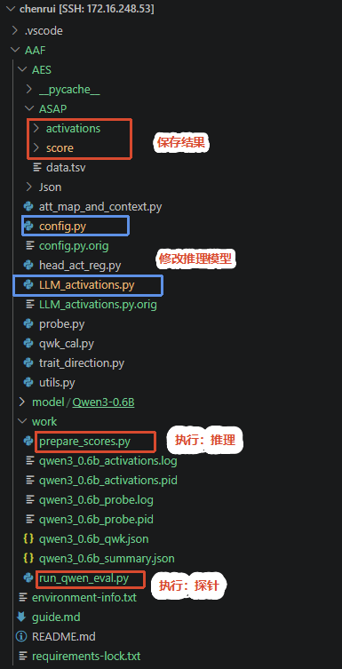

🔗 复现论文 Activations as Features: Probing LLMs for Generalizable Essay Scoring Representations[https://ojs.aaai.org/index.php/AAAI/article/view/40292]：

🔗 [与gpt对话记录](https://chatgpt.com/s/cx_6ab4df192bec8191a59a4ee43bc9a1b2)

<!--more-->

## 复现后的项目结构



## 第一步 拉取https://github.com/MRWEIm/AAF.git并配置环境

vscode ssh remote中连接了服务器，一切命令请在路径shelly@shellyB115:~/chenrui$ 下进行，不要在本地运行。

安装环境的位置：已创建的虚拟环境 idea_novelty（python=3.9）

conda create -n idea_novelty python=3.9
conda activate

> vscode 右下角Python解释器修改：
> 1. Ctrl + Shfit + P
> 2. Python select interpreter
> 3. 从列表选择，或者输入解释器的绝对路径

> **baukit（作者 David Bau）**，是 NLP / 可解释性研究圈非常常用的轻量 PyTorch 工具库，专门用来**抓取模型中间激活、管理 hook、探测 LLM 内部表征**

按照AI的pip指令，已经配置好环境，配置固化在`requirements-lock.txt`

> 配置环境上，AI还是很nb的；包冲突不再是问题
>
> 唯一需要自己介入的是git clone网络问题，这个用代理解决

## 第二步 下载开源模型

代码中是 Llama-2-7b ：需要meta验证（小红书上说要美国IP+美国信息），加上模型本身至少需要24G以上（实际更多，AI建议留150G），因此先从小参数模型验证，选择了Qwen3-0.6B（无需验证、对存储要求小）

修改了源代码中的模型配置：

| 文件 | 原内容 | 修改后 |
| ---- | ---- | ---- |
| config.py | `default='Llama-2-7b-chat-hf'` | `default='Qwen3-0.6B'` |
| LLM_activations.py | `args.model_name = 'Llama-2-7b-chat-hf'` | `args.model_name = 'Qwen3-0.6B'` |
| LLM_activations.py | `model_folder = f'/{args.model_name}'` | `model_folder = args.model_name` |
| LLM_activations.py | `type_list = ['all', 'wo_p', 'wo_i', 'only_e']` | `type_list = ['all']` ，不复现消融|

## 第三步 后台提取激活(监控进度：nohup + setsid)

```bash
cd ~/chenrui/AAF
mkdir -p work

nohup setsid env \
  CUDA_VISIBLE_DEVICES=0 \
  PYTHONUNBUFFERED=1 \
  /home/shelly/.conda/envs/idea_novelty/bin/python -u \
  AES/LLM_activations.py \
  --model_name Qwen3-0.6B \
  > work/qwen3_0.6b_activations.log \
  2>&1 < /dev/null &

echo $! | tee work/qwen3_0.6b_activations.pid
```

> 服务器未安装 tmux ，不想动全局环境，所以监控改用系统自带的 `nohup + setsid`

查看进度

```bash
tail -f work/qwen3_0.6b_activations.log
```

退出`tail`

```bash
Ctrl+C
```

检查进程

```bash
pid=$(cat work/qwen3_0.6b_activations.pid)
ps -fp "$pid"
```

检查已完成组合数（应为42）

```bash
find AES/ASAP/activations/Qwen3-0.6B \
  -type f -name '*.pt' | wc -l
```

## 第四步 执行探针

```bash
cd ~/chenrui/AAF

nohup setsid env \
  PYTHONUNBUFFERED=1 \
  OMP_NUM_THREADS=4 \
  MKL_NUM_THREADS=4 \
  /home/shelly/.conda/envs/idea_novelty/bin/python -u \
  work/run_qwen_eval.py \
  > work/qwen3_0.6b_probe.log \
  2>&1 < /dev/null &

echo $! | tee work/qwen3_0.6b_probe.pid
```

## 结果

### Qwen3-0.6B 激活提取耗时

在 NVIDIA RTX A4000 16 GB 上，对 8 个 prompt、42 个有效
prompt-trait 组合共 67,604 篇次进行激活提取：

- 开始：2026-09-23 21:55:01
- 结束：2026-09-23 22:42:25
- 墙钟时间：47 分 23.6 秒
- 平均吞吐量：约 23.8 篇次/秒

激活文件大小（AES/ASAP/activations/Qwen3-0.6B/）：7.3G

### 与论文的整体对比

总体对比：

| 指标 | 本次复现 | 论文 | 差值 |
|---|---:|---:|---:|
| Prompt AVG | 0.6273 | 0.622 | +0.0053 |
| Trait AVG | 0.6213 | 0.615 | +0.0063 |

绝大多数指标与论文非常接近，说明激活提取、归一化、cross-prompt probe 和 QWK 流程正确。

### Prompt 对比

| Prompt | 复现 | 论文 | 差值 |
|---|---:|---:|---:|
| P1 | 0.6240 | 0.610 | +0.0140 |
| P2 | 0.6165 | 0.619 | −0.0025 |
| P3 | 0.6496 | 0.598 | +0.0516 |
| P4 | 0.6666 | 0.662 | +0.0046 |
| P5 | 0.6869 | 0.681 | +0.0059 |
| P6 | 0.6199 | 0.621 | −0.0011 |
| P7 | 0.5522 | 0.570 | −0.0178 |
| P8 | 0.6031 | 0.610 | −0.0069 |

主要偏差集中在 P3，其他多数结果相差不到 0.02。

### Trait 对比

| Trait | 复现 | 论文 | 差值 |
|---|---:|---:|---:|
| Holistic | 0.6894 | 0.689 | +0.0004 |
| Content | 0.6212 | 0.620 | +0.0012 |
| Organization | 0.5612 | 0.565 | −0.0038 |
| Word Choice | 0.6139 | 0.610 | +0.0039 |
| Sentence Fluency | 0.6086 | 0.605 | +0.0036 |
| Conventions | 0.5563 | 0.549 | +0.0073 |
| Prompt Adherence | 0.6448 | 0.637 | +0.0078 |
| Language | 0.6326 | 0.632 | +0.0006 |
| Narrativity | 0.6633 | 0.634 | +0.0293 |

Trait 结果高度吻合；最大差异是 Narrativity。

差异可能来自模型仓库 revision、PyTorch/Transformers 版本、浮点计算，以及论文未公开的精确运行快照。论文还直接在测试集上选最佳 head，这会放大微小数值差异。