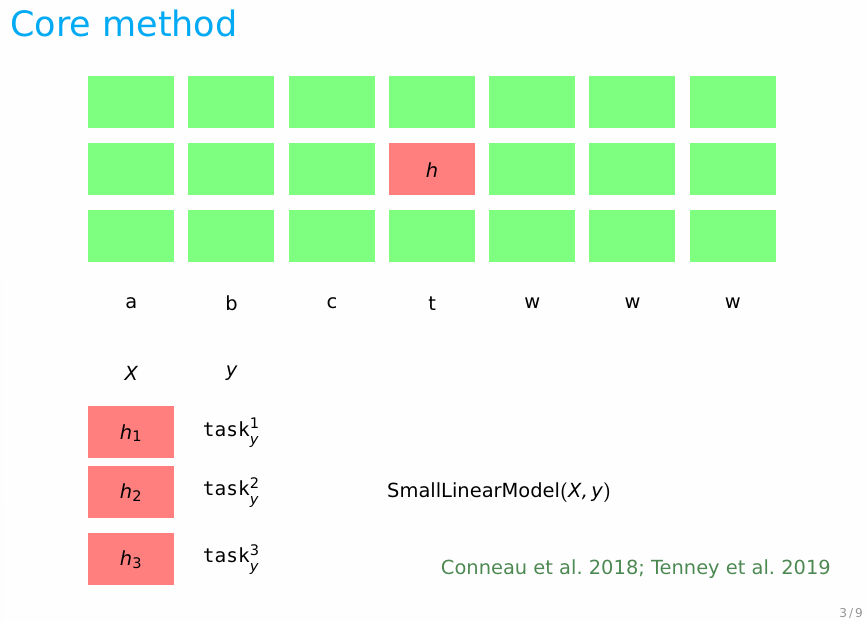

## 什么是探针？

“探针”，即一个`有监督模型`，用来确定目标模型隐藏表示中的信息内容。

❗️ 需要注意的是，探针只能证明目标模型的表征中“存在某种信息”，但不能证明该表征与模型最终输出结果之间存在因果关系。

若探针本身的学习能力过强（如深层网络）则不能有效证明目标模型中编码了该信息，因为这个信息有可能是探针自己学习到的。因此研究中通常先使用`线性探针`。

## 怎么用探针？

### 步骤

1. 冻结目标模型
2. 提取注意力头的激活，作为探针模型的输入$X$
3. 用$(X, y)$训练探针模型，查看预测结果
4. 如果预测准确，说明激活中编码了特定信息

探针方法类似监督学习，只是使用了一套特殊特征（大模型的hidden states）作为输入，训练一个普通分类器。

### Selectivity 选择性

$$选择性 = 探针在真实任务上的性能 - 探针在控制任务上的性能$$

> 所谓控制任务，即将标签y随机打乱，再训练探针模型。
> 
> 如果真实任务和控制任务性能差不多（选择性接近0），表明探针高分只是它自己硬性记住了标签，不能说明目标模型编码了该信息。

## 什么时候用探针？

1. 想弄清楚模型的某一层在做什么——BERTology 领域
2. 想要利用模型内部信息——Activations as Features论文

> **BERTology 领域：** 专门研究 BERT 类预训练语言模型内部学到了什么知识的研究方向，探针是该领域最经典工具。Tenney 2019（What Does BERT Look At?）就是用线性探针去挖掘 BERT 里面句法、语义信息的标志性论文

## 补充：无监督探针

有监督探针需要人工标注标签（比如词性标注）；而**无监督探针**不需要标注，直接从隐藏向量中挖掘结构、聚类、独立成分，自动发现表征里面蕴含的结构，不需要外部标签。

用到无监督探针的相关论文在参考资料中有提及。

## 参考资料

- 斯坦福cs224u-2021-analysis-part4-handout.pdf](https://web.stanford.edu/class/cs224u/2022/slides/cs224u-analysis-part4-handout.pdf)