> 后端：Django
> 
> 参考：<https://www.bilibili.com/video/BV19spseGE9Y?spm_id_from=333.788.videopod.episodes&vd_source=ae5b8f4c462b3f90ff8881691bdf718b&p=2>

<!--more-->

## 常用命令汇总

```bash
## 创建Django项目
django-admin startproject project_name

## 创建Django应用
python manage.py startapp app_name

## 生成数据库迁移文件
python manage.py makemigrations [app_name]

## 执行迁移文件
python manage.py migrate [app_name]

## 查看迁移状态（[ ] 表示未应用 [X] 表示已应用）
python manage.py showmigrations [app_name]

## 清除缓存
python manage.py clearcache

## 测试用开发服务器
python manage.py runserver

## 查看已注册路由
python manage.py show_urls

# 启动 Redis
redis-server.exe redis.windows.conf

# 在项目终端进行 Redis 连接测试
redis-cli ping
# 如有跟着博客配置密码
redis-cli -a your_password ping
# 返回 PONG 即说明Redis成功运行

# 启动 Celery Worker（添加参数 -P） 
celery -A nrsmAPI_project worker -l info -P eventlet

# 再启动 Celery Beat
celery -A nrsmAPI_project beat --loglevel=info


```

开发接口尽可能遵循Restful规范：
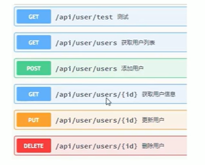

## 前端架构搭建

### node 和 npm 和 vue 版本

(venv) D:\administrator\College\课后笔记\SE-软工\newsAPI_project>node -v
v22.11.0

(venv) D:\administrator\College\课后笔记\SE-软工\newsAPI_project>npm -v
10.9.0

(venv) D:\administrator\College\课后笔记\SE-软工\newsAPI_project>vue --version
@vue/cli 5.0.8

```bash
## 启动项目
npm run serve
```

## JWT前后端交互

DRF框架

```bash
## 安装drf
pip install djangorestframework -i https://pypi.tuna.tsinghua.edu.cn/simple

## 安装drf-jwt
pip install djangorestframework-jwt  -i https://pypi.tuna.tsinghua.edu.cn/simple
```

## 跨域问题

前后端不在同一个域

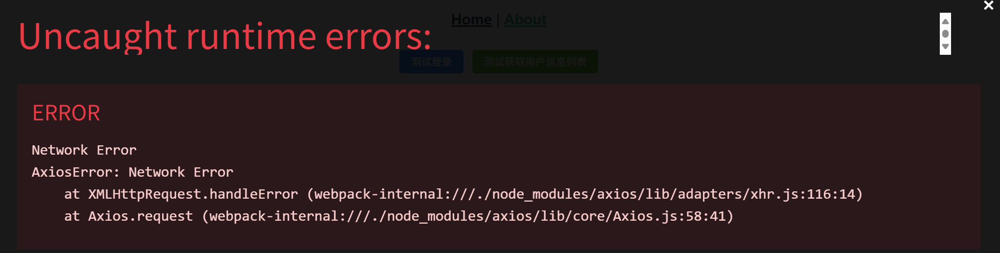

CORS（跨域资源共享，Cross-Origin Resource Sharing）是一种跨域访问的机制，可让Ajax实现跨域
访问。

```bash
## 安装django-cors-headers库
pip install django-cors-headers -i https://pypi.tuna.tsinghua.edu.cn/simple
```

## 前端登录静态界面

attest文件夹下方静态资源，如全局css样式、网页背景图片等

view下每一个.vue文件是一个页面，新建Login.vue

router/index.js中加上Login.vue的路由
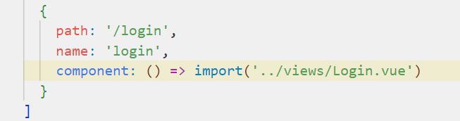

App.vue相当于是主界面
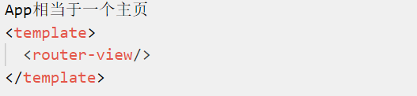

App.vue设置下全局样式
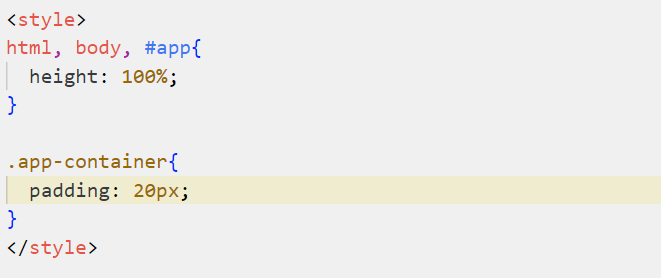

## 自定义icon实现

（略过）

## Django局域网访问

> 参考博客：<https://blog.csdn.net/sandalphon4869/article/details/107601765>

```bash
python manage.py runserver 0.0.0.0:8000
```

## 后端登录功能逻辑实现

流程：
- 前端传递参数
- 后端验证
- 验证成功后，生成jwt
- 将状态码和token传回给前端
- 前段将token加入请求头的AUTHORIZATION字段中

> 注意model中的属性名要和view中的一致，否则会出现500错误。
> 先建数据库，再写后端容易出现此类问题
>
> 以及如果重新执行迁移文件发现无法No migrations to apply.，则在数据库中drop掉django_migrations表（delete对应迁移记录也可以），再重新运行python manage.py migrate [app]

## 上传GitHub

### requirements.txt

将当前功能git到仓库，并撰写README.md文档

环境依赖文件生成

```bash
## 法一：环境中所有的包
pip freeze > requirements.txt

## 法二：如果仅保留项目必需的包，可使用pipreqs
pip install pipreqs ## 安装pipreqs（如已安装则跳过）
pipreqs .
```

### 使用.env管理环境变量

Django项目根目录下的`settings.py`文件存储有很多敏感信息，包括数据库的ip、密码，密钥，邮件服务密钥等。在提交到GitHub前，应先对其进行处理。

创建`.env`文件，定义所需的环境变量，通常与manage.py文件在同目录下

```
## .env

## Django 设置
SECRET_KEY=
DEBUG=False
TIMEZONE=

## 允许的域名
ALLOWED_HOSTS=

## 数据库配置
ENGINE=
NAME=
USER=
PASSWORD=
HOST=
PORT=

## Celery / Redis
CELERY_BROKER_URL=
CELERY_RESULT_BACKEND=
```

```bash
## 安装python-dotenv库，用于读取.env中的环境变量
pip install python-dotenv

## settings.py
import os
from dotenv import load_dotenv
load_dotenv() ## 加载 .env 文件

## 使用 os.getenv('.env中对应的键') 替换敏感信息
```

### 查看自己的下载源

```bash
pip config list
```

本项目用的是 global.index-url='https://pypi.tuna.tsinghua.edu.cn/simple'


## 新闻浏览

```bash
## 创建空迁移文件(由于需要在建表的同时插入初始值，非空限制)
python manage.py makemigrations --empty news

## 安装Django扩展包（Django版本从Django-4.1.13变为了django-4.2.21）
pip install django-extensions

## 查看已注册路由
python manage.py show_urls
```

### 基于游标的新闻列表分页


### 单条新闻详情

出现了500，服务器内部无法响应的问题，多半与数据库连接有关

打印错误`  Unknown column 'news_tag.id' in 'field list'`

在终端执行以下语句，返回正常，排除了数据库连接/连接错误的问题
```bash
python manage.py shell

from news.models import News

## 查询 id=1 的新闻对象
news = News.objects.get(id=1)

## 打印新闻标题等信息
print(news.id)
print(news.title)
print(news.body)
print(news.pub_time)
print(news.website)
print(news.url)
print(news.images)
print(news.summary)
```

问题出在news_tag表与model定义不匹配，缺少了Django自加的id字段。解决方法：

1. 手动在数据库增加id字段。但由于已经有外键依赖，总之就是不给我加。
2. 修改model定义。但似乎修改后不行
3. 找出哪里用到了id。√

发现是序列化时，尽管没有显式访问id字段，但是在某个语句背后有访问到。尝试绕过id字段的访问即可。AI修改如下

```python
class NewsSerializer(serializers.ModelSerializer):
    tags = serializers.SerializerMethodField()

    class Meta:
        model = News
        fields = ['id', 'title', 'body', 'pub_time', 'website', 'url', 'images', 'tags']
    def get_tags(self, obj):
        return list(obj.newstag_set.select_related('tag').values_list('tag__ch_name', flat=True))
```

```python
## 报错的代码
## models.py
class NewsTag(models.Model):
    news = models.ForeignKey(News, on_delete=models.CASCADE, db_column='news_id')
    tag = models.ForeignKey(Tag, on_delete=models.CASCADE, db_column='tag_id')

    class Meta:
        db_table = 'news_tag'
        unique_together = (('news', 'tag'), )

## serializers.py
class NewsSerializer(serializers.ModelSerializer):
    tags = TagSerializer(source='newstag_set', many=True, read_only=True)

    class Meta:
        model = News
        fields = ['id', 'title', 'body', 'pub_time', 'website', 'url', 'images', 'tags']

```
> *来分析一波*
> 
> tags = TagSerializer(...) 背后的机制为
>
> 首先news.newstag_set.all()  ## 获取该新闻对应的所有 NewsTag 对象
> 
> 然后通过 TagSerializer 提取每个 NewsTag 对象中的 .tag 字段进行序列化。
>
> 也就是说，它会**访问 news_tag 表中的记录，默认情况下会加载所有字段**（包括 id），即使你没用到它。


> *教训*
> 
> 尽可能从后端建表，不然就会出现很多这样那样的问题

潜在问题：

如果从后端在news_tag中创建新的数据，可能会再次报错。不过由于目前新闻分类的操作由独立的python脚本完成，因此暂时可以睁一只眼闭一只眼。

### 标签列表

很简单，只要返回tag表中的所有对象（为了方便先序列化）即可

## 兴趣推送

### 实现过程

明确实现步骤

- 每天在 feedtime 为每个用户推送新发布的新闻。
- 推送内容根据用户的兴趣标签过滤。
- 使用 Celery 定时任务 + Redis。
- 使用增强版 FeedLog 记录每条新闻的推送记录。

首先在用户模块添加`用户兴趣设置`和`获取用户兴趣`模块。目前仅基于分类标签（为简化，暂时不考虑实体）

由于推送功能相对独立，为方便管理，新建一个app

```python
python manage.py startapp feed
```

老操作，配置setting和路由

```python
## nrsmAPI_project/settings.py
INSTALLED_APPS = [
    ...
    'feed.apps.FeedConfig',
]

## nrsmAPI_project/urls.py
urlpatterns = [
    ...
    path('feed/', include('feed.urls')), ##  推送模块
    ...
]
```

```bash
## 安装实现定时任务的依赖
pip install celery redis

## 安装管理定时任务的依赖
pip install django-celery-beat
```

> 注意：用户可以不选择设置兴趣标签，则系统不会推送。但是在SRS里好像写的是必须选择三个以上的标签（尬）。总之，后端对无标签的情况是有处理的。比如可能后面用户自己去主页取消了兴趣勾选。
>

### 迁移数据库

由于需要插入一些测试数据，为了避免把服务器上的数据库搞乱，考虑将数据库备份到本机上

#### 使用命令行（失败）

```bash
## 导出数据库
mysqldump -h 192.168.207.77 -u root -p nrsm > nrsm_backup.sql

## 输入密码

## 在本地
## 创建备份数据库
create database nrsm;

## 查看数据库是否创建成功
show database;

## 切换到备份数据库
use nrsm;

## 使用source命令导入SQL文件（根目录为当前mysql命令窗口所在的目录）
source nrsm_backup.sql;
```

出现问题，查看数据库发现仅由部分数据导入成功
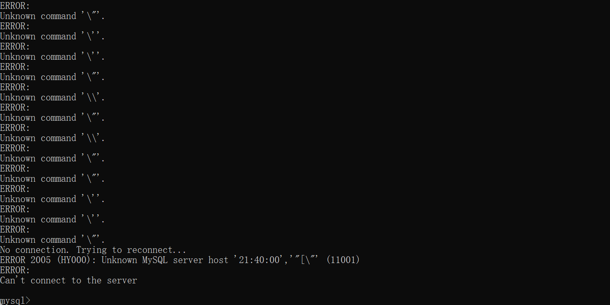

改为使用mysql命令

```bash
mysql -u root -p nrsm_tt < nrsm_backup.sql
```

问题仍然存在
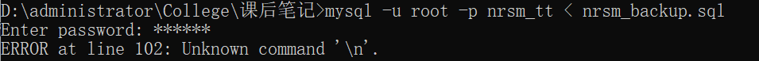

#### 使用mysql workbench（成功）

**直接使用mysql workbench的Export和Import功能**

备份成功！

### 邮件发送功能

一上来就搞“定时 + 邮件 + 兴趣过滤”不好测试（主要是对其中的流程不熟，一旦出错难以定位问题），因此决定先实现邮件推送功能。

使用的邮箱为163（QQ也可以）

> 参考博客：
> - <https://blog.csdn.net/KaiSarH/article/details/116724290>
> - <https://blog.csdn.net/weixin_42677653/article/details/114535724>

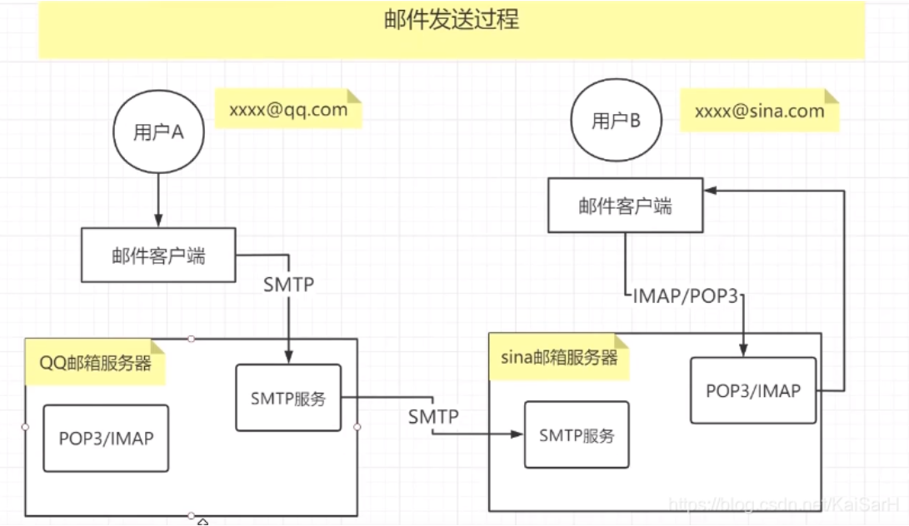

Django邮件功能主要基于SMTP协议。基本原理为

- 授权邮箱给Django
- 向对应收件人发送邮件
- django.core.mail封装了电子邮件的自动发送SMTP协议

#### 开通SMTP服务

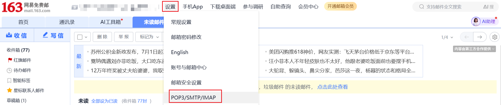

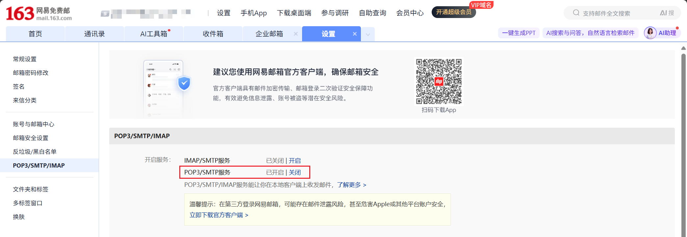

```python
## settings.py

## 邮件配置
EMAIL_BACKEND = 'django.core.mail.backends.smtp.EmailBackend'
EMAIL_USE_TLS = True  ## 是否使用TLS安全传输协议(用于在两个通信应用程序之间提供保密性和数据完整性)
EMAIL_USE_SSL = False  ## 是否使用SSL加密，qq企业邮箱要求使用，163邮箱设置为True的时候会报ssl的错误
EMAIL_HOST = 'smtp.163.com'  ## 发送邮件的邮箱的SMTP服务器，这里用的是163邮箱
EMAIL_PORT = 25  ## 发件箱的SMTP服务器端口，默认是25
EMAIL_HOST_USER = 'test@163.com'  ## 发送邮件的邮箱地址
EMAIL_HOST_PASSWORD = os.getenv('EMAIL_HOST_PASSWORD') ## 发送邮件的邮箱密码(这里使用的是授权码)
```

#### 邮件发送测试

通过view测试。这里用了自己的163发送给自己的qq邮箱

```python
## feed/utils.py
import os
from django.core.mail import send_mail
from dotenv import load_dotenv
load_dotenv() ## 加载 .env 文件
def send_mail_test():
    print("开始发送邮件...")
    send_mail('邮件主题',
              '邮件内容',
              os.getenv("EMAIL_HOST_USER"),
              ['test_1@domain.com', 'test_2@domain.com'],  ## 这里可以同时发给多个收件人
              fail_silently=False
             )

    print("发送邮件成功!")
```

```python
## feed/views.py
class EmailTestView(APIView):
    def get(self, request):
        send_mail_test()
        return JsonResponse({"code": 200, "info": "邮件发送成功"})
```

```python
## feed/urls.py
from django.urls import path
from feed.views import EmailTestView

urlpatterns = [
    ...
    path('email_test/', EmailTestView.as_view(), name='email-test'), ## 邮件发送测试
]
```

postman测试

```
http://127.0.0.1:8000/feed/email_test/
```

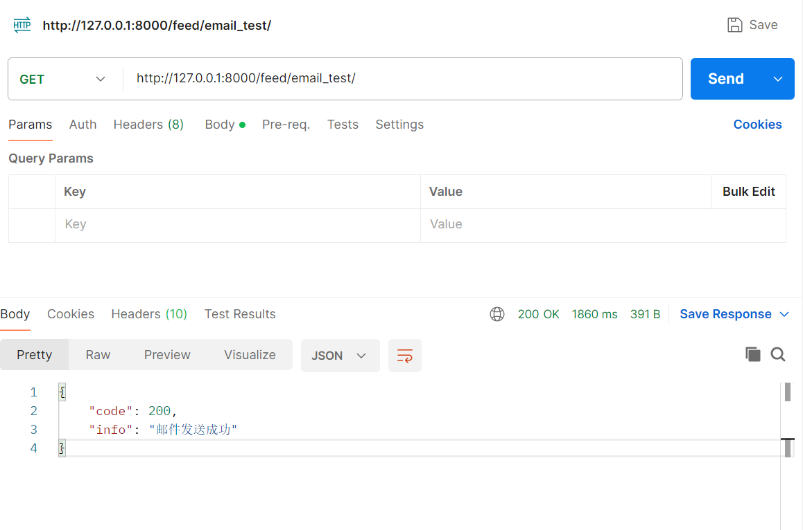

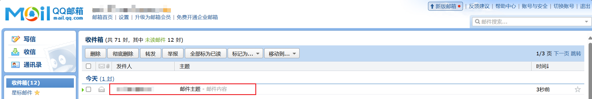

> 错误：SMTPAuthenticationError
>
> 原因是身份验证错误，检查一下settings.py中的邮箱配置是否正确，尤其注意EMAIL_HOST_PASSWORD，是开启服务时给你的授权码，不是平时的登录密码！！！不是平时的登录密码！！！不是平时的登录密码！！！

### 定时邮件发送（django-background-tasks 失败）

> 参考博客：<https://deepinout.com/django/django-questions/271_django_how_to_use_djangobackgroundtasks.html>

使用Django自带的插件django-background-tasks

```bash
# 安装django-background-tasks插件
pip install django-background-tasks
```

```python
# settings.py
INSTALLED_APPS = [
    ...
    # 后台任务
    'background_task'
]
```

```bash
# 生成 background_task 的迁移文件（可选）
python manage.py makemigrations background_task

# 应用 migration，只创建 background_task 表
python manage.py migrate background_task
```

> 错误：RuntimeError: 'cryptography' package is required for sha256_password or caching_sha2_password auth methods
>
> 在使用 MySQL 数据库时，尝试通过 sha256_password 或 caching_sha2_password 认证方式连接数据库，但 Python 的数据库驱动（通常是 mysqlclient 或 pymysql）缺少支持这些认证方式所需的 cryptography 库。
>
> 安装 cryptography 库即可 `pip install cryptography`

在 `feed/tasks.py` 中创建一个后台任务

```python
# feed/tasks.py
import os
from dotenv import load_dotenv
from django.core.mail import send_mail
from background_task import background

...

load_dotenv() # 加载 .env 文件
@background(schedule=60)  # 每60秒运行一次
def send_email_task():
    """
    定时发送邮件任务
    """
    print("开始执行定时邮件发送任务...")
    send_mail(
        'Hello',
        'This is a background task to send an email.',
        os.getenv("EMAIL_HOST_USER"),
        ['to@domain.com'],  # 这里可以同时发给多个收件人
        fail_silently=False,
    )
```

在 `feed/views.py` 中设置调用任务的接口

```python
# feed/views.py
class BackTaskView(APIView):
    def get(self, request):
        send_email_task()
        return JsonResponse({"code": 200, "info": "后台任务执行成功"})
```

在 `feed/urls.py` 中配置路由

```python
from django.urls import path
from feed.views import FeedHistoryView, EmailTestView, BackTaskView

urlpatterns = [
    ...
    path('back_task/', BackTaskView.as_view(), name='back-task') # 后台任务
]
```

在终端运行任务

```bash
python manage.py runserver

# 再打开一个终端
"""
--duration=0 表示无限运行。
--sleep=5 表示每 5 秒检查一次是否有新任务。
"""
python manage.py process_tasks --duration=0 --sleep=5
```

发现只有在请求服务时会建立后台任务，无法实现按照设定的频率进行

解决方案

1. 伪周期调度
   1. 在方法内自己调度自己
   2. 然而实测出现创建任务的没有严格按照所设定的间隔，导致一次发送多封邮件，可能和时间同步有关系
2. 使用 Celery + Celery Beat √
   1. Celery：异步任务队列
   2. Celery Beat：周期性任务调度器

### 定时邮件发送（Celery + Celery Beat）

```bash
pip install celery django-celery-beat redis

# 生成 django-celery-beat 的迁移文件
python manage.py makemigrations django_celery_beat

# 应用 migration，只创建 django-celery-beat 表
python manage.py migrate django_celery_beat
```

配置celery

> 参考博客：<https://developer.aliyun.com/article/1582419>

下载Redis（Windows）

> 参考博客：<https://developer.aliyun.com/article/1395346>

完成后，执行以下步骤

```
# 启动 Redis
redis-server.exe redis.windows.conf

# 在项目终端进行 Redis 连接测试
redis-cli ping
# 如有跟着博客配置密码
redis-cli -a your_password ping
# 返回 PONG 即说明Redis成功运行

# 启动 Django 开发服务器
python manage.py runserver

# 启动 Celery Worker
celery -A nrsmAPI_project worker --loglevel=info

# 启动 Celery Beat
celery -A nrsmAPI_project beat --loglevel=info
```

> 错误：(venv) D:\administrator\College\课后笔记\News-recommendation-system\e2\newsAPI_project>redis-cli ping
> (error) NOAUTH Authentication required.
>
> 在 redis.windows.conf 文件中配置了密码，但是在终端执行命令时未提供。加上 -a your_passoword 即可。

> 如果修改了 redis.windows.conf 后，需要重新启动 Redis 才会生效
> （很简单的道理，但总是容易忘记囧）

> 检查 Celery Worker，celery -A nrsmAPI_project worker --loglevel=info 的启动日志，发现没有加载任何任务
>
> 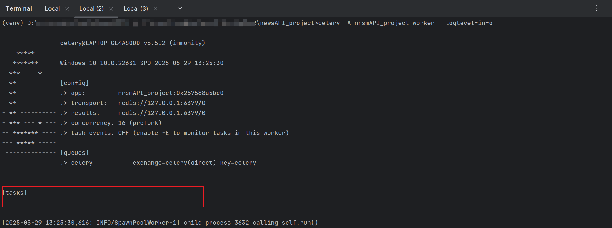
>
> 在 feed/apps.py 中强制导入 import feed.tasks 即可

```
The above exception was the direct cause of the following exception:

Traceback (most recent call last):
  File "c:\users\fshjp\appdata\local\programs\python\python39\lib\site-packages\billiard\pool.py", line 362, in workloop
    result = (True, prepare_result(fun(*args, **kwargs)))
  File "c:\users\fshjp\appdata\local\programs\python\python39\lib\site-packages\celery\app\trace.py", line 640, in fast_trace_task
    tasks, accept, hostname = _loc
ValueError: not enough values to unpack (expected 3, got 0)
```

在win10上运行celery4.x，celery5.x会出现此问题

> 参考博客：<https://blog.csdn.net/showgea/article/details/109342664>

```bash
pip install eventlet

# 添加参数 -P 
celery -A nrsmAPI_project worker -l info -P eventlet

# 再启动 Celery Beat
celery -A nrsmAPI_project beat --loglevel=info
```

时间间隔为 20s ，实测差不多 +- 1s

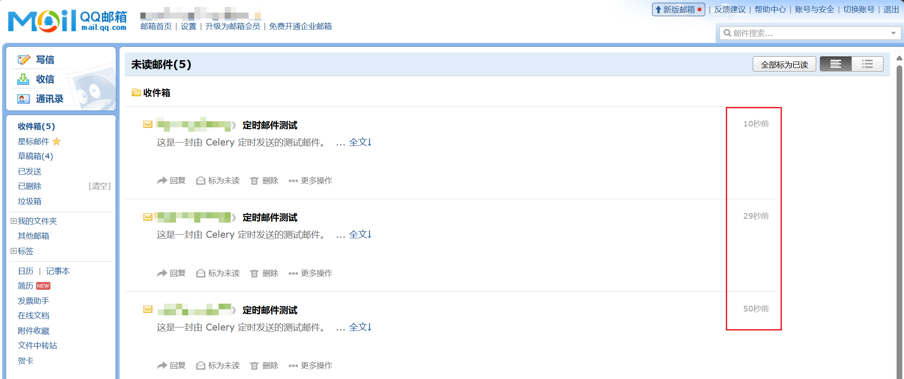

### 根据用户兴趣和时段推送新闻

```python
# settings.py
...
#  Celery配置
CELERY_BROKER_URL = os.getenv('CELERY_BROKER_URL', 'redis://127.0.0.1:6379/0') #  使用Redis作为消息代理
CELERY_RESULT_BACKEND = os.getenv('CELERY_RESULT_BACKEND', 'redis://127.0.0.1:6379/0') #  使用Redis作为结果存储
CELERY_ACCEPT_CONTENT = ['json']
CELERY_TASK_SERIALIZER = 'json'
CELERY_RESULT_SERIALIZER = 'json'
CELERY_TIMEZONE = os.getenv('TIMEZONE', 'UTC') #  北京时间

# Celery beat
CELERY_BEAT_SCHEDULER = 'django_celery_beat.schedulers:DatabaseScheduler'

# 定时任务配置
from celery.schedules import crontab

CELERY_BEAT_SCHEDULE = {
    'check-user-feedtime-every-minute': {
        'task': 'feed.tasks.check_and_send_news_feed',
        'schedule': crontab(minute='*'),  # 每分钟检查是否满足推送条件
    },
}


LOGGING = {
    'version': 1,
    'disable_existing_loggers': False,
    'handlers': {
        'console': {
            'class': 'logging.StreamHandler',
        },
    },
    'loggers': {
        'feed.tasks': {
            'handlers': ['console'],
            'level': 'INFO',
        }
    }
}


# 邮件配置
EMAIL_BACKEND = 'django.core.mail.backends.smtp.EmailBackend'
EMAIL_USE_TLS = True  # 是否使用TLS安全传输协议(用于在两个通信应用程序之间提供保密性和数据完整性)
EMAIL_USE_SSL = False  # 是否使用SSL加密，qq企业邮箱要求使用，163邮箱设置为True的时候会报ssl的错误
EMAIL_HOST = 'smtp.163.com'  # 发送邮件的邮箱的SMTP服务器，这里用的是163邮箱
EMAIL_PORT = 25  # 发件箱的SMTP服务器端口，默认是25
EMAIL_HOST_USER = os.getenv("EMAIL_HOST_USER")  # 发送邮件的邮箱地址
EMAIL_HOST_PASSWORD = os.getenv('EMAIL_HOST_PASSWORD') # 发送邮件的邮箱密码(这里使用的是授权码)
```

```python
# feed/tasks.py
import os

from celery import shared_task
from datetime import timedelta, datetime
from django.utils import timezone
import logging

from django.core.mail import send_mail

from feed.utils import send_mail_test

logger = logging.getLogger(__name__)

@shared_task
def daily_news_feed(user_ids=None):
    """
    执行每日新闻推送任务
    推送自上次推送以来关注标签下的新新闻
    :param user_ids: 用户ID列表，若为None则推送所有用户
    """
    # 延迟导入模型
    from feed.models import FeedLog
    from user.models import SysUser, UserLike
    from news.models import News

    now = timezone.now()
    logger.info("开始执行每日新闻推送任务")

    if user_ids is None:
        users = SysUser.objects.all()
    else:
        users = SysUser.objects.filter(id__in=user_ids)

    for user in users:
        try:
            last_log = FeedLog.objects.filter(user=user).latest('send_time')
            last_sent_time = last_log.send_time # 获取上次推送时间
        except FeedLog.DoesNotExist:
            last_sent_time = now - timedelta(days=1) # 新用户无推送记录，则将推送时间设置为当前时间减去1天

        liked_tags = UserLike.objects.filter(user=user).values_list('tag_id', flat=True)
        if not liked_tags.exists():
            logger.debug(f"用户 {user.username} 未设置兴趣标签，跳过推送")
            continue

        new_news = News.objects.filter(
            pub_time__gte=last_sent_time,
            newstag__tag_id__in=liked_tags
        ).distinct().order_by('-pub_time')

        count = new_news.count()
        logger.info(f"用户 {user.username} 新闻数量：{count}")

        if count == 0:
            logger.info(f"用户 {user.username} 无新新闻可推送")
            continue

        # 创建推送记录
        feed_logs = []
        for news in new_news:
            feed_logs.append(FeedLog(
                user=user,
                news=news,
                title=news.title,
                summary=news.summary or '',
                status='pending'
            ))

        FeedLog.objects.bulk_create(feed_logs)


        # 邮件发送后记录需要更新的状态
        success_logs = []
        failed_logs = []

        for log in feed_logs:
            try:
                subject = f"【{user.username}】今日新闻推送"
                message = f"""
                标题：{log.title}
                摘要：{log.summary}
                发布时间：{log.news.pub_time}
                """
                from_email = os.getenv("EMAIL_HOST_USER")
                recipient_list = [user.email]

                send_mail(
                    subject=subject,
                    message=message,
                    from_email=from_email,
                    recipient_list=recipient_list,
                    fail_silently=False
                )
                success_logs.append(log)
            except Exception as e:
                logger.error(f"推送失败给用户 {user.username}，错误：{e}")
                log.status = 'failed'
                failed_logs.append(log)

        # 批量更新成功发送的日志
        if success_logs:
            FeedLog.objects.filter(id__in=[log.id for log in success_logs]).update(status='sent')

        # 批量更新发送失败的日志（如果需要区分）
        if failed_logs:
            FeedLog.objects.filter(id__in=[log.id for log in failed_logs]).update(status='failed')


    logger.info("每日新闻推送任务完成")


@shared_task
def check_and_send_news_feed():
    """
    每分钟检查用户是否到达 feedtime，如果匹配，则触发推送
    """
    from user.models import SysUser

    now = timezone.now()
    logger.info(f"正在检查是否满足推送条件，当前时间：{now}")

    users = SysUser.objects.all()
    triggered_users = []

    for user in users:
        feed_time = user.feedtime
        today = now.date()
        target_time = timezone.make_aware(datetime.combine(today, feed_time))
        delta = (now - target_time).total_seconds()

        # 判断当前时间是否在用户 feedtime 的 ±1 分钟内
        if abs(delta) <= 60:
            triggered_users.append(user)

    if triggered_users:
        logger.info(f"将为以下用户发送新闻推送：{[u.username for u in triggered_users]}")
        daily_news_feed.delay(user_ids=[u.id for u in triggered_users])
    else:
        logger.info("没有用户需要推送")


# 注册定时任务（运行 manage.py runserver 时自动加载）
from celery import current_app as celery

@celery.on_after_configure.connect
def setup_periodic_tasks(sender, **kwargs):
    sender.add_periodic_task(
        timedelta(minutes=1),  # 每分钟检查一次
        check_and_send_news_feed.s(),
        name='每分钟检查用户推送时间'
    )
```

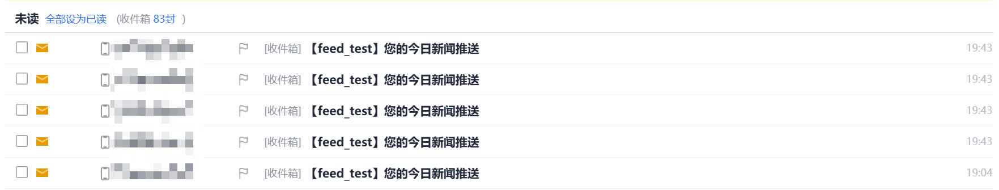

### 时区问题

> 参考博客：<https://blog.csdn.net/qq_41341757/article/details/109319850>

面对依赖时间的任务，绕不开时区问题。在Django项目中，一般这样处理

- 前端传来的时间数据，在数据库中以UTC保存
- 后端处理时，统一用UTC为标准

在 settings.py 中，设置USE_TZ = True，TIME_ZONE = 'Asia/Shanghai' ，在涉及时区处理时候，Django将自动转换

## 修改推送设置

为简单处理（同时也考虑到真实情况），舍弃原定的频率（每日/每周/每月）并统一为每日推送，保留用户可修改具体的推送时间的功能。

## 获取用户信息（不包含敏感信息）

主要为了方便前端

## 兴趣推送（标签 + 关键词）

在用户模块添加一个新的表UserKeyword

修改推送逻辑

- 匹配（标签 ∪ 关键词）的新闻
  - 原本设计为关键词过滤，但考虑到标签和关键词会互相影响，例如用户可能设置“政治”标签 + “赵丽颖”关键词，但取交集可能会导致没有新闻同时符合这两个条件

编写单元测试

执行单元测试

```bash
python manage.py test feed.tests.DailyNewsFeedTest
```

## 检索

## 邮箱验证

## 管理端

### 初始化

管理员共享一个账号，无需注册。但要存入一条默认账号密码

创建一个独立的`init_admin.py`，并执行以下语句

```bash
python manage.py init_admin
```

