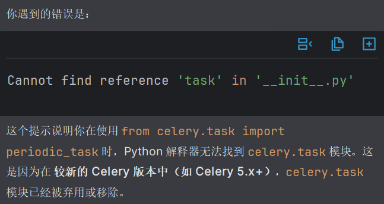

(venv) D:\administrator\College\课后笔记\SE-软工\newsAPI_project>vue ui
(node:23504) [DEP0040] DeprecationWarning: The `punycode` module is deprecated. Please use a userland alternative instead.
(Use `node --trace-deprecation ...` to show where the warning was created)

```bash
在 nodejs v21.0.0 以上会出现该提示

识别哪些依赖项要使用punycode
npm ls punycode

发现`-- (empty)，可能意味着没有吧，先不管了
```

---

vue ui创建项目报错Cannot read properties of undefined (reading 'indexOf')

```bash
缺少了yarn管理器，在cmd窗口安装一个yarn管理器即可
npm install -g yarn
```

---

使用SMTP服务时，出现SMTPAuthenticationError

```
原因是身份验证错误，检查一下项目中的邮箱配置是否正确，尤其注意EMAIL_HOST_PASSWORD，是开启服务时给你的授权码，不是平时的登录密码！！！不是平时的登录密码！！！不是平时的登录密码！！！
```

---

(venv) D:\administrator\College\课后笔记\News-recommendation-system\e2\newsAPI_project>redis-cli ping

(error) NOAUTH Authentication required.

```
在 redis.windows.conf 文件中配置了密码，但是在终端执行命令时未提供。加上 -a your_passoword 即可。
```

---



---
报错信息

```
TypeError: Object of type set is not JSON serializable
```

错误代码

```
UserKeyword.objects.create(
    user=self.user,
    name={'Trump', 'Biden'},     # ← 这里用了 set（不合法）
    place={'USA', 'Washington'},
    organization={'White House'}
)
```

错误分析

{'Trump', 'Biden'} 是一个 set

而 Django 的 JSONField 在保存时会调用 Python 内置的 json.dumps() 来序列化数据

set 类型不能被 json.dumps() 序列化，因此报错：

解决办法

将所有 set 换成 list 

---

配置环境 pip install tensorflow==2.0.0 时，报错 ValueError: check_hostname requires server_hostname

```
解决办法：关闭代理服务器（VPN）
```

---

在安装 spacy==2.2.4 时，出现 cymem 和 murmurhash 编译失败的报错。

```
解决办法：
1. 更换为python 3.7 环境
2. 逐个安装 spacy 2.2.4 依赖的固定版本
pip install cymem==2.0.3 murmurhash==1.0.2 preshed==3.0.2 thinc==7.4.0 blis==0.4.1
3. pip install spacy==2.2.4
```
> 原因分析：缺少 Windows 的 io.h 头文件，无法编译 cymem 和 murmurhash 这两个底层 C 扩展。PyPI 上很多依赖（cymem、murmurhash 等）已经不再为 Py3.6 提供预编译的 Windows wheel，只能强行从源码编译 → 导致需要 MSVC 编译环境 + 头文件。

---

配置好README.md环境后，在执行train_CTS.py文件时出现TypeError: Descriptors cannot not be created directly.由于Found existing installation: protobuf 4.24.4，与tensorflow版本不兼容

```
# 卸掉现有的版本
pip uninstall protobuf
# 安装适合的版本
pip install protobuf==3.20.3
# 锁定版本，避免以后自动升级（可选）
pip install "protobuf<3.21,>=3.20.0" 
```

---

Resource averaged_perceptron_tagger not found. Please use the NLTK Downloader to obtain the resource:
/>>> import nltk 
/>>> nltk.download('averaged_perceptron_tagger')

代码在用 nltk.pos_tag()，但是 缺少 NLTK 的词性标注模型 averaged_perceptron_tagger

```
按照提示来做就好：
python
import nltk
nltk.download('averaged_perceptron_tagger')
exit()
```
