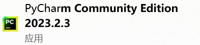
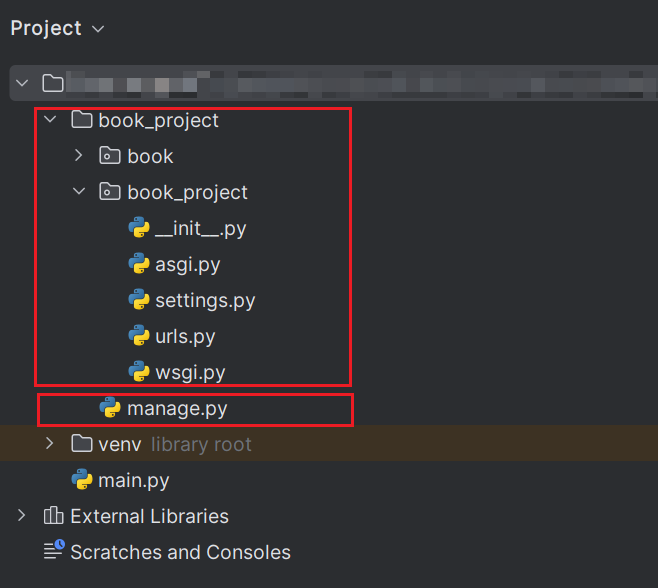
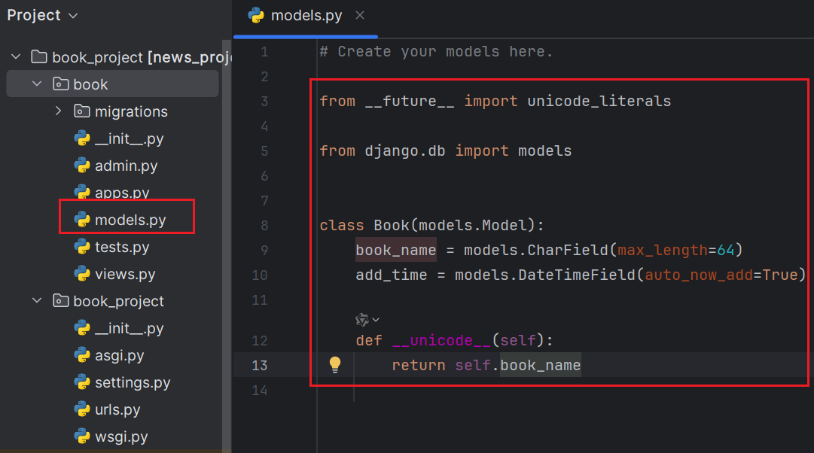
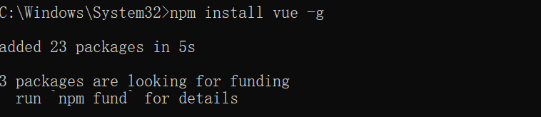
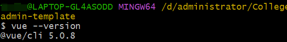
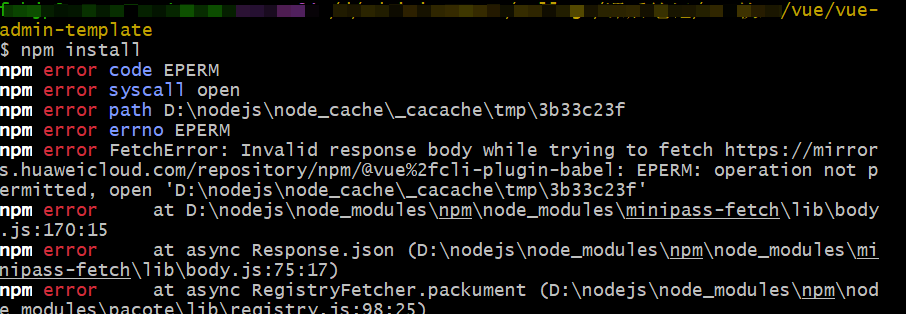
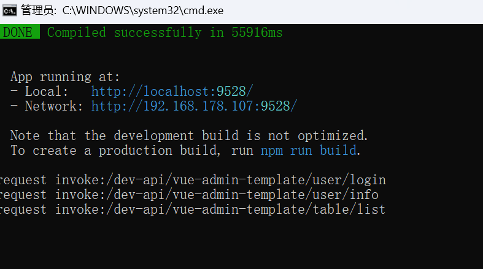
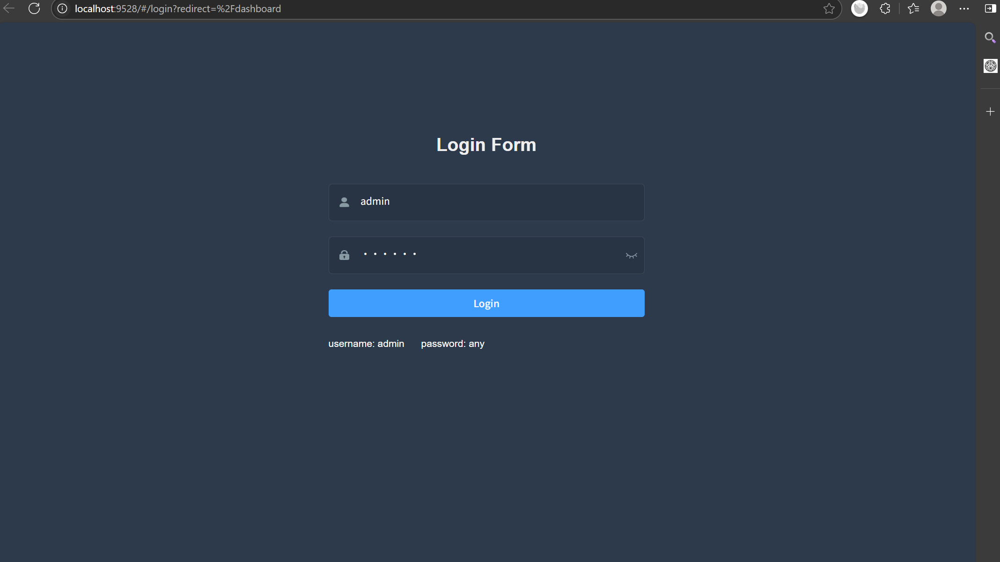
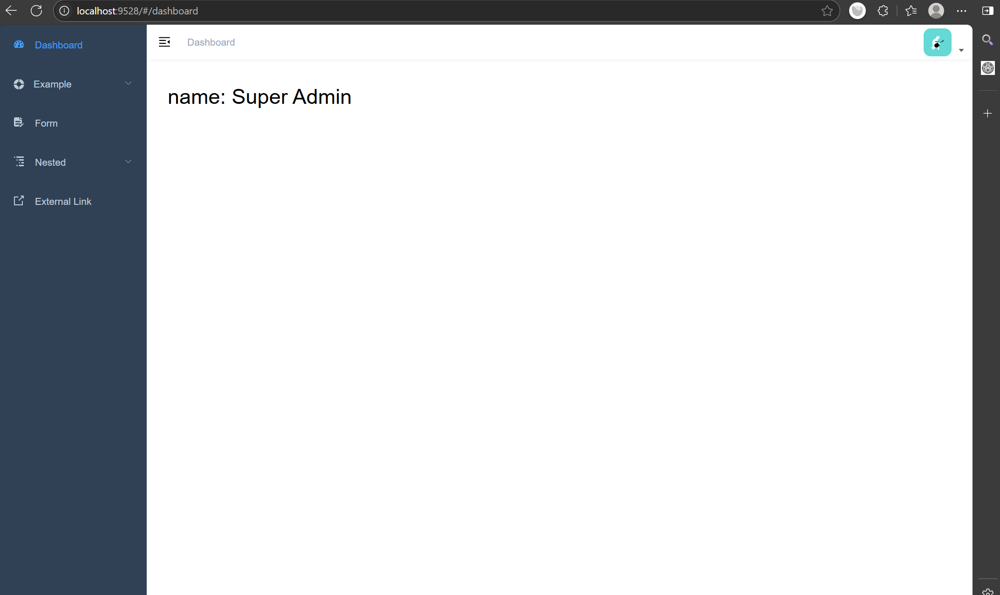

> 参考博客：<https://www.cnblogs.com/zhangxue521/p/12957816.html>

## Django的安装

### 前提

- pycharm
- Python 3.9.6

### cmd命令

```bash
pip install Django==3.2 -i https://pypi.tuna.tsinghua.edu.cn/simple
```

> 版本兼容参考：<https://blog.csdn.net/qq_28770757/article/details/123415364>

检查是否安装成功:

```python
python -m django --version
```

---

## 新建Django项目

```bash
django-admin startproject book_project # 新建项目

cd book_project # 进入项目根目录

python manage.py startapp book # 新建app
```



## 后端准备

### 更改settings配置

- 更改数据库配置
- 导入pymysql包
- 更改installed_apps

### 创建model



### 新增接口

- 添加图书
- 显示图书列表

### 创建app路由

### 初始化数据库

```bash
python manage.py makemigrations

python manage.py migrate
```

## 启动服务

```bash
python manage.py runserver
```

> You’re seeing this error because you have DEBUG = True in your Django settings file. Change that to False, and Django will display a standard 404 page.
> <https://www.w3schools.com/django/django_404.php>

## 测试接口

使用postman测试接口
<https://www.postman.com/downloads/>

```bash
# 添加书籍test1
http://127.0.0.1:8000/api/add_book?book_name=test1

# 返回书籍列表
http://127.0.0.1:8000/api/show_book
```

## 前端

### 安装vue

```bash
npm install -g @vue/cli
```

> - 在安装 @vue/cli 时遇到了多个 npm warn deprecated 警告，表明某些依赖表已被废弃（deprecated）

> - 然而还是无法执行。
> $ npm run dev
> vue-admin-template@4.4.0 dev
> vue-cli-service serve
> 'vue-cli-service' 不是内部或外部命令，也不是可运行的程序或批处理文件。

因此需要重头装Vue，在已经提前装好

- node -v v22.11.0
- npm -v 10.9.0

的前提下，步骤如下：
<https://blog.csdn.net/Javachichi/article/details/132868889>

```bash
# 配置npm的全局模块目录和缓存目录配置到自己创建的那两个目录

npm config set prefix "D:\nodejs\node_global"

npm config set cache "D:\nodejs\node_cache"

# 下载源换为华为源
# 注：淘宝源不行npm config set registry https://registry.npm.taobao.org

npm config set registry https://mirrors.huaweicloud.com/repository/npm/

# 查看是否修改成功

npm config list

# 配置环境变量
# 用户变量 - Path - D:\nodejs\node_global
# 系统变量 - 新建 - 变量名：NODE_PATH - 变量值：D:\nodejs\node_global\node_modules
# 系统变量 - Path - %NODE_PATH%

# 安装vue

npm install vue -g

# 安装vue/cli

npm install -g @vue/cli

# 测试vue是否配置成功

vue --version
```




### 安装模版

```bash
# 克隆项目

git clone https://github.com/PanJiaChen/vue-admin-template.git

# 进入项目根目录

cd vue-admin-template

# 项目安装所需依赖， 建议不要用 cnpm 安装 会有各种诡异的bug 可以通过如下操作解决 npm 下载速度慢的问题
npm install --registry=https://registry.npm.taobao.org

# 本地开发 启动项目

npm run dev
```

> 
> 遇到此类报错可能是因为没有用管理员权限，需要用管理员权限打开cmd，cd到vue模板项目根目录，再执行命令行

执行`npm run dev`成功后，可看到web界面



登录后可看到


### 与服务端交互

在src->api->创建book.js文件

```vue
import request from '@/utils/request'

export function getList(){
    return request({
        url: '/api/show_books',
        method: 'get',
    })
}

export function addbook(book_name) {
    return request({
        url: '/api/add_book',
        method: 'get',
        params: { book_name }
    })
}
```

## 改Bug

### 前端修改

### 后端修改

pip install django-cors-headers
