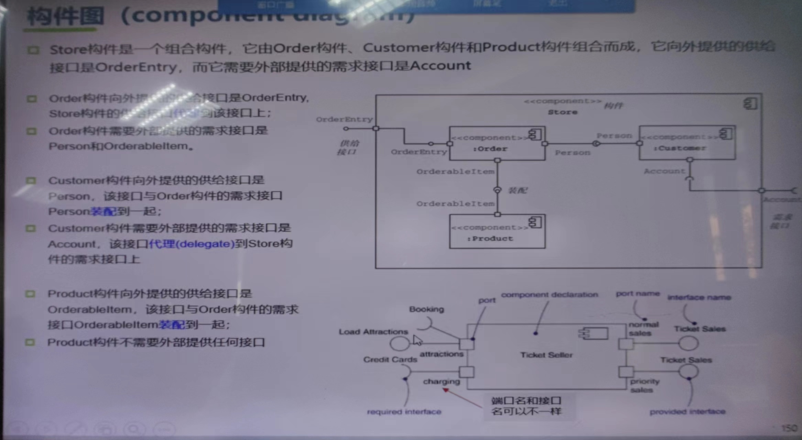

## 进程视图

- 面向系统架构师和开发人员

- 适用于多进程多视图，关注系统的并发性、分布性、性能和资源分配

- 形式
  - UML类图

- 进程间的交互
  - 进程间的交互可以用时序图表示

- 单线程的Web服务器

- 多线程的Web服务器
  - 每来一个连接，创建一个线程。从线程池中分配空余的线程
  - 多线程协作
    - 线程同步
    - 进程通信
      - 死锁的预防、检测和解除

- AWS ELB（弹性负载均衡器）Amazon Web Services提供的负载均衡服务

- 活动图
  - 哪些进程
  - 中间件
  - 进程间信息的交互

- 部署图

## 开发视图

  - 关注
    - 模块划分
    - 文件组织
    - 依赖关系
    - 构建过程
  - 分层架构描述
    - UML——包图
  - 源代码目录结构
  - 包图
    - 按业务逻辑分
      - 适合综合性强的团队
    - 按功能性需求分
      - 依赖其他模块，调试困难

- 构件图
  - 关注系统的逻辑结构（物理部署由部署图描述）
  - 构件和类
    - 相似：
    - 不同：类（逻辑），构件（物理）
  - UML
    - package::component
    - 
      - ○供给接口
      - 半圆是需求接口
      - 装配：$--(○$
  - 要素
    - 构件
    - 接口库
    - 接口
    - 端口
    - 关系
  - 
    - 图标形式、或interface形式

    - 连接件
      - 直连
      - 代理连接
  - 依赖和实现关系
    - 虚线箭头、实现镜头
    - 

## 部署视图

- 非功能性需求
- 关注
  - 软件节点
  - 硬件
  - 逼数
  - 运行
  - 寻访环境
- 部署时，尽量不要动源代
- 开发和测试、生产的环境是有不同的
- 向外开放，浏览请求增多时，并发性差

- 部署图
  - 元素
    - 节点
    - 工件
    - 通信路径

## 场景视图

- “4+1”的“+1”部分
- 用例图、序列图
- 作用
  - 验证其他4个视图
    - 逻辑视图
    - 开发视图
    - 进程视图
    - 部署视图
  - 将其他四个视图整合到一起，展示他们是如何协同工作的
  - 和甲方沟通
- 使用
  - 1. 优先关键场景
    - 高频使用场景
  - 2. 绘制其交互图
  - 3. 检查其他四个视图是否一致，是否满足场景需求
  - 4. 调整其他四个视图，保持一致性
  - 5. 沟通

## 视图的选择

- 有所侧重
  - Web：逻辑视图、开发视图
  - 并发：进程视图、物理视图
  - 单击：部署视图（多余）
  - 单进程视图：进程视图（多余）
- 额外新添视图
  - 技术视图（可以画）
    - 技术选型：编程语言、操作系统、数据库、框架、中间件、库
  - 数据视图
    - ER
    - O-R Mapping技术
      - 解决对象与数据库模型不匹配问题，实现对象和记录之间的转换
      - 核心功能
        - 持久化
        - 查询
        - 关系管理
  - 上下文视图
    - 顶层的数据流程图
  - 行为视图
  - 安全视图
  - 性能视图
  - 运营视图
  - 业务视图

## 非功能性

### 可用性的策略

- 错误检测
  - 方法
    - 被动式查错。设置检查点
    - 主动式查错。规定时间检错
  - 技术
    - 命令（双工）
    - 心跳（单工）
    - 异常
- 错误恢复
  - 策略
    - 备份
      - 热。主系统和备份系统同时运作，只有主系统返回结果，丢弃备份系统的结果
      - 暖。主系统将结果发送给备份系统用于状态同步，备份系统不进行处理。
        - 正在进行未结束的进程无法恢复
        - 
      - 闲置。周期性地在持久性介质上创建检查点。
    - 修复
      - 影子修复
      - 检查点修复
- 错误预防
  - 研发时
  - 运维时

### 可维护性策略

- 局部化修改
- 防止涟漪效应
- 推迟绑定时间

### 性能策略

- 资源请求：降低系统处理所有事件时对资源的需求
- 资源管理：提高资源的利用效率
  - 并发。相应出现临界资源分配的问题
  - 数据库副本。额外考虑一致性
  - 增加可用的资源
- 资源仲裁

### 安全性

- 抵御攻击
  - 认证授权
  - 数据加密
- 检测攻击
- 在攻击中恢复

### 可测试性

### 易用性

> 课后熟悉UML符号

## 软件质量

### SOLID 面向对象的设计原则

#### 单一职责

- 只有一个是导致变更的原因
- 一个类就是一个职责

#### 开闭原则

- 封装可变点

#### LSP

- 子类应该替换基类

#### ISP原则

- 接口隔离
- 接口不能做得过于庞大

#### DIP依赖倒置

- 高层模块不应该依赖低层模块。即细节在低层，高层不需要考虑低层？低层服务高层

#### CARP复用

- 尽量用组合聚合复用，不要用继承（继承有很多毛病，继承会破坏封装，会把父类的实现细节暴露给子类，父类变，子类跟着变）
- 缺点：组合和聚合的关系比较复杂
- Coad法则
  - 子类能完全替代父类，就是好的继承
  - 只有满足
    - 子类是超类的特殊种类，has-A 和 is-A 只有 is-A 才符合继承关系
    - 子类具有扩展超类的责任，是扩展，不是替换

#### LoD迪米特法则

- 最少知识原则，一个对象应该只知道与自己直接相连的对象交互，对其他对象不需要知道其内部

#### 总结

- SRP单一职责原则
- OCP开闭原则
- LSP里氏代换原则
- DIP依赖倒置原则
- ISP接口隔离原则
- CARP组合聚类原则
- LoD迪米特法则

### 设计模式（基础：GoF）

#### Design Pattern

- 划分方法一（按目的，划分为三大类）
  - 创建型模式
    - 关键对象的创建过程
      - 工厂方法
        - 适用场景：在运行时才确定需要创建的对象类型
      - 抽象工厂
        - 适用场景：对个相关产品的家族，e.g.UI组件；系统有多余一个的产品族，系统只消费其中某一产品族
      - 建造者模式 Builder
        - 结构
          - 产品
          - 抽象建造者：定义构造产品的抽象步骤
          - 具体建造者：实现抽象建造者，返回具体的部件并构建返回产品
          - 指导者：调用建造者的方法，调整
        - 使用：复杂对象，组成部件会变化，但组成的过程不会变化。
        - 不要在指导Director里返回产品Product
          - 职责分离
            - 明确Factory和Director
          - 灵活性和封装性
          - 可选的Director角色
        - 适用场景：复杂的内部结构，每一个内部结构成分本身可以是对象，也可以是一个对象的组成部分。
      - 原型模式 Prototype
        - 适用场景：大量类似的对象，减少重复初始化的开销
        - 关键机制：
          - 深拷贝：包含引用（如列表、对象），创建完全独立的新实例，缺点：开销大
            - 实现方式
              - 手动拷贝
              - 序列化
              - 第三方库
          - 浅拷贝：简单的结构，对引用类型仍指向源对象（共享），JAVA的Object.clone()属于这一种
        - JAVA语言天生支持原型模式
        - 原型管理器
      - 单例模式
        - 饿汉法
        - 懒汉法
      - 适配器模式
        - 在不改变原有实现上，让不兼容接口转变为兼容接口
        - 实现方式
          - 类适配器
          - 对象适配器
      - 桥接名词
  - 结构型模式
    - 处理类或对象的组合方式
    - 模式列表7种
      - ...
  - 行为性模型
    - 关注类和对象之间的交互方式及职责分配
    - 模式列表11种

- 划分方法二（按作用域，划分为动静两类）
  - 类模式（静态）
  - 对象模式（动态）
