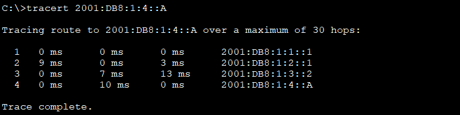
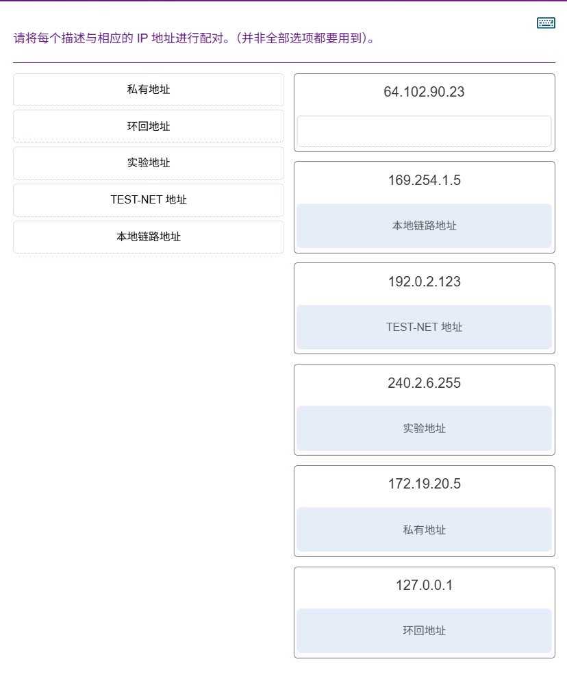
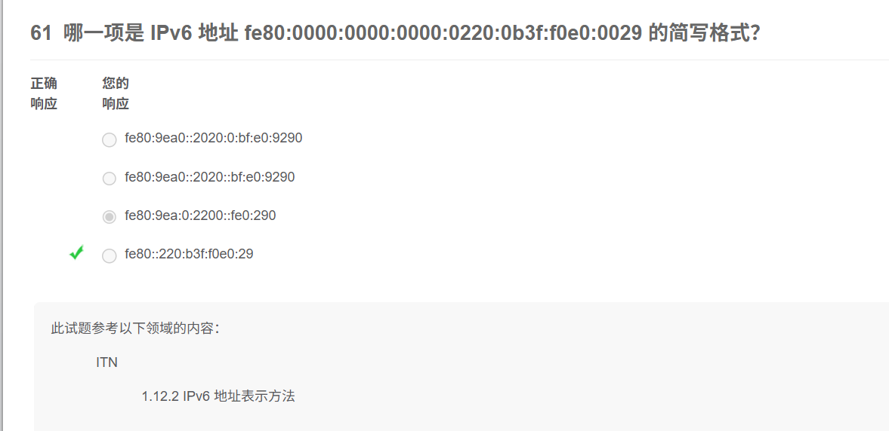

<!--more-->

## 在跟踪从 PC1 到 PC2 的路由时，显示的三个 IPv6 地址是什么? （选择三项。）

## 请将每个描述与相应的 IP 地址进行配对。（并非全部选项都要用到）。

## 子网掩码 255.255.255.224 的前缀长度记法如何表示？

## 下列哪个地址是 IP 地址3FFE:1044:0000:0000:00AB:0000:0000:0057 最短的缩写？

## 哪一项是 IPv6 地址 fe80:0000:0000:0000:0220:0b3f:f0e0:0029 的简写格式？

> 被坑啦！

