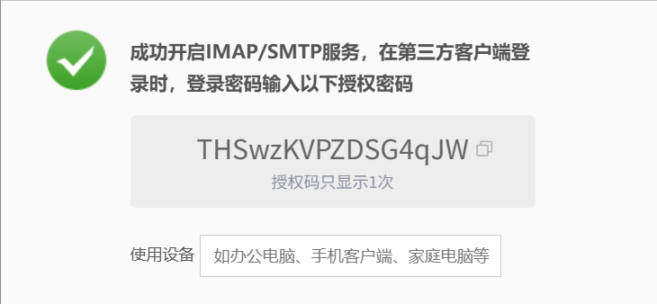

31-互联网程序设计

<!--more-->

> 先搞懂练习，需结合自己的代码
>
> 有时间再梳理其他内容
>
> 考试时打包完整的 NetworkAPP（防止缺少依赖）

## 第 1 讲 Java 图形窗口程序设计

创建窗体 UI

## 第 2 讲 网络对话程序设计（最最基础版 TCP）

### 知识点

套接字类有两个基本的方法可以获得两个通信管道：  
     socket.getInputStream()方法可获得输入字节流的入口； 
     socket.getOutputStream()方法可获得输出字节流的出口；

### 课程任务

1. 用 TCPClientFX.java 连接教师服务器；
2. 发送你的学号、姓名、密码及时间戳信息，之间不要留空格，用#隔开，例如：20170000007#程旭元#你的密码#时间戳

### 代码注释

客户端程序 1：TCPClient.java 具有网络接收和发送能力的程序。 
客户端程序 2：TCPClientFX.java 为界面模块。 
服务器程序：TCPServer.java 用于监听客户端的连接，具有网络接收和发送

时间戳是通过 System.currentTimeMillis()获得的毫秒数

## ⭐ 第 3 讲 多线程程序设计技术

### 知识点

在第 2 讲的基础上进行改进，引入多线程

关于接收并显示服务端信息的代码都必须删除，否则 → 阻塞/乱序

匿名内部类或 lambda 表达式中，不能访问外部类方法中的非 final 类型的局部变量。可使用临时常量，或者将定义为类中的成员变量

### 课程任务

制作登录查看平时成绩程序

### 代码注释

TCPClientThreadFX.java：多线程接收客户端；

LookUpScore.java：同 TCPClient.java；

LookUpScoreFX.java：同 TCPClientThreadFX.java，只将窗体 title 为“登录查成绩”

## 第 4 讲 网络文件传输程序设计

### 知识点

文件传输协议规定（RFC 959），网络文件传输中用两个 TCP 端口来实现: 
⚫ 一个端口（21 号）用来对话，传递控制信息，总是开启； 
⚫ 一个端口（20 号）实现文件数据传递服务，有数据传输服务时开启。

本讲实现一个简单的远程文件传输系统，我们用 2021 端口实现对话服务，如身份验证、文件列表信息浏览等，用
2020 端口传递数据文件（即文件下载）。

### 课程任务

1. 启动客户端 FileClientFX.java 程序，连接 202.116.195.71 : 2021 服务器，关注提示信息，根据提示信息操作； 
2. 根据信息显示区的文件列表，在信息输入区输入要下载文件的全名（如果实现了扩展练习要求的快捷功能，可以使用鼠标拖动加亮方式【有实现】），使用“发送”按钮发送此文件名，服务器会给出相应反馈提示信息； 
3. 在信息输入区输入要下载文件的全名（如果实现了扩展练习要求的快捷功能，可以使用鼠标拖动加亮方式），点击“下载”按钮从服务器下载文件，下载完毕可获取 1 分； 
4. 运行下载的 jar 文件（双击，或控制台使用 `java -jar 文件名`，如果无法运行，请参见教案中的《jar 无法运行的原因和解决方案.pdf》），如果运行成功，则可获取完整的 5 分。

### 代码注释

客户端程序： 
- 主界面客户端程序 FileClientFX.java； （在 TCPClientThreadFX 基础上添加了“下载”按钮）
  - 已完成扩展练习一：鼠标高亮选中；
  - 已完成扩展练习二：成员内部类 ReceiveHandler，封装新线程读取信息的功能

- 文件对话客户端程序（控制进程）FileDialogClient.java； （TCPClient 基础）
- 文件数据客户端程序（数据传输进程）FileDataClient.java。  主要功能是向服务器的数据端口请求连接；

服务端程序： （教师机，自己未实现）

- 文件对话服务器程序 FileDialogServer.java，开启 2021 端口； 
  - 主要功能: 身份验证、文件目录传送。 

- 文件数据服务器程序 FileDataServer.java，开启 2020 端口。 
  - 主要功能：传送文件名，接收文件。


## ⭐ 第 5 讲 多用户服务器程序设计

### 知识点

服务端的多线程，实现服务多个客户端

方案一般是：主线程只负责监听客户请求和接受连接请求，用一个线程专门负责和一个客户对话，建议采用 `线程池` 的方式

```java
ExecutorService executorService = Executors.newFixedThreadPool(n);
```

将和客户对话部分的代码抽取到一个 Runnable 的实现类 Handler（见附录）的 run 方法中，然后丢给线程池去执行。方便起见，Handler 作为主程序的内部类。

修改 idea 配置，同时运行多个相同的程序

### 课程任务

教师计分服务器将开启多个线程连接你的多用户版本 TCP 服务器（TCPThreadServer.java），你的 TCP 服务器需要按约定判断关键字，按要求返回对应信息，信息正确就可以获得本次课堂分，具体步骤如下： 

- 教师计分服务器将会向你的 TCPThreadServer.java 服务器程序发起多个连接，并发送信息，
  你的服务器如果收到信息："来自教师服务器的连接" ，你的服务器应该回发 1 ；如果收到信息："教师服务器再次发送信息" ，则回发 2 。
  按这个约定修改你的服务器程序，并临时关闭防火墙以及本机上的虚拟网卡，运行该服务器程序，运行的端口号建议大于 1024，不要和常用的端口号冲突，例如可以使用 7777； 
- 用第三讲的 TCPClientThreadFX 客户端连接教师计分服务器 202.116.195.71 : 8008，发送学号验证通过后， 按如下格式发送你的服务器运行的端口号：我的服务器已经准备好，端口号是&****& 。 注意：信息一定要严格按照要求，*号用真实端口号代替，两个&是信息间隔符；

### 代码注释

TCPThreadServer.java：多服务器，采用固定数量的线程池

GroupServer.java：在 TCPThreadServer.java 基础上修改，添加核心的群组发送方法 sendToAllMembers，用于给所有在线客服转发信息

TcpThreadServer2.java：解决 OOM 的问题，提供动态调整大小的线程池

## ⭐ 第 6 讲 UDP 套接字程序设计

### 知识点

和 TCP 编程相比，UDP 在使用前不需要进行连接，没有流的概念。只要知道地址（IP 地址和端口号）就可以给对方发送信息；

UDP 编程几个关键的 Java 类：DatagramSocket，DatagramPacket，MulticastSocket。

UDP 套接字只有一种 DatagramSocket，不像 TCP 区分客户套接字和服务器套接字。UDP 编程不太区分服务端和客户端

- UDP 套接字创建：DatagramSocket datagramSocket = new DatagramSocket();
  - 用于发送网络数据：datagramSocket.send(DatagramPacket packet)；
  - 用于接收网络数据：datagramSocket.receive(DatagramPacket packet)；// 程序会在这里阻塞
  - 指定超时：datagramSocket.setSoTimeout(int tmeout)
- UDP 数据报文的创建：DatagramPacket(byte [ ] data, int length, InetAddress remoteAddr, int remotePort); // 指明发送给谁，int length 表示要读取的数据长度，byte [ ] data 就是用于存储报文数据的字节数组缓存
  - InetAddress getAddress( )：如果是发送的报文，返回的是目标主机的地址信息；如果是要接收的报文，返回的是发送该数据报文的主机地址信息；
  - int getPort( )：如果是发送的报文，返回的是目标主机的端口；如果是要接收的报文，返回的是发送该数据报文的主机端口；
  - byte [ ] getData( ): 从报文中取数据，返回与数据报文相关联的字节数组；

> 如果你的客户端设置为 send 一个信息，然后 receive 等待回应信息，可以用这个方法来设置超时，避免程序无限等待；但如果你的客户端类似 TCP 的设计方式，开启一个新线程来专门 receive 信息，那就不要用这个命令，否则在等待的过程中就超时报错了。

### 课程任务

你的 UDP 客户端向教师计分服务器发送信息

- 关闭你机器上的防火墙，将你的 UDPServer 服务器在指定的端口号运行（建议端口号大于 1024，例如 8008）； 
- 用你的客户端给计分服务器 202.116.195.71:6868 发送如下指定信息：我的 UDP 服务器已经准备好，端口号是&& 
  注意，信息一定要严格按照要求，表示你的 UDP 服务器的端口号，两个&是信息间隔符；
- 教师端的服务器会自动访问你的 UDP 服务器，如果你的服务器工作正常，反馈信息符合要求，就会提示成功信息，后台记录课堂成绩；

> 如果长时间显示正在访问你的 UDP 服务器……而没有后续提示信息，那么检查你的服务端程序，是否收发信息代码编写有误、是否端口号等信息有误，检查客户端否接收消息程序编写有误（例如没有用多线程的方式循环 receive 消息），并检查是否自己的防火墙没有关闭，教师返回的信息可能被防火墙拦截。或者是使用了 wifi 完成练习，由于 NAPT 的影响造成教师返回信息无法送达。

### 代码注释

UDPClient.java：UDP 客户端程序

UDPClientThreadFX.java：UDP 客户端发送 UI

UDPServer.java：UDP 服务器

Multicast.java：扩展练习一，组播程序

MulticastFX.java：扩展练习一，组播程序 UI

## 第 7 讲 邮件发送程序设计

### 知识点

### 课程任务

### 代码注释

## ⭐ 第 8 讲 HTTP 程序设计

### 知识点

### 课程任务

### 代码注释

URLClientFX.java：输入网址，获取 HTTP 源码

HTTPClient.java：

HTTPClientThreadFX.java：

HTTPSClient.java：

HTTPSClientThreadFX.java：

### 期末测试

[online course](https://oc.gdufs.edu.cn/finaltest2)

可以 F12 开发者工具 → 三个竖点 → 更多工具 → 网络条件 → 取消用户浏览器默认 →java→ 刷新网页

怀疑考试当天会修改值，需要重新获取一次

<input type="hidden" id="keyValueForFinalTest2" value="d2875ed0eaf253aa9e33c6e89a234d77">


##  第 9 讲 扫描程序设计

### 知识点

### 课程任务

### 代码注释

⭐HostAndPortScannerWithProgressBarFX.java：同时扫描主机和端口，并有进度条，100%是处理完全部的主机和端口，一般点多线程扫描即可

HostScannerFX.java：只扫描主机

PortScannerFX.java：只扫描端口

## 第 10 讲 网络抓包与发包程序设计(一)

### 知识点

### 课程任务

### 代码注释

ConfigDialog.java：抓包设置弹窗

PacketCaptureFX.java：抓包程序 UI

UDPClient.java：与第 6 讲一致

UDPClientThreadFX.java：用 StringBuffer 拼接多行信息，其余与第 6 讲一致

## 第 11 讲 网络抓包与发包程序设计（二）

### 知识点

### 课程任务

### 代码注释

如何找到正确的 MAC

> 包在链路层发给默认网关，再发到局域网中其他网段的主机

```bash
# Windows
ipconfig # 查看默认网关
arp -a | findstr <默认网关> # 查看默认网关的 MAC 地址
```

## ⭐ 第 12 讲&第 13 讲 RMI 程序设计（一）

### 知识点

1. A 和 B 统一接口：
2. 序列化和反序列化：因为程序中是字符和字符串，网络中是二进制流
3. 流程：打包参数 → 解包 → 调用方法 → 打包 → 解包

创建远程接口

使用 `名字` 来找到服务器上的远程对象（类比“点单”，把名字登记，访问时就可以找到）

接口里可能一部分自己实现，一部分教师机实现

### 课程任务

调用老师的服务

老师调用自己的服务

### 代码注释


## 第 14 讲 基于 Java 的网络数据库程序设计

### 知识点

MySQL 不同版本的驱动有区别

任务服务器 → 启动 MySQL→ 开始栏 →MySQL…Unicode

### 课程任务

密码是两个小写的 student

一定要重新登录查分

### 代码注释

DBOperate1.java：硬数据库配置，插入和查询指定表

DBOperate2.java：通过资源 Resources/db.txt 管理，添加查看整个数据所包含的表名和每个表的数据（字段名+具体值），包含删除数据。

ConnectionProvider.java：读取

PropertyReader.java：读取 db.txt 的配置

## 第 15 讲 非阻塞通信模式的 TCP 编程

非阻塞版本的 TCPServer

## 考试参考 1

说明
此为 GDUFS2020 秋季学期互联网程序设计 期末考的题解，相关代码可以在 https://github.com/LeslieLeung/NetworkApp 获取。

### 第一题

题目：读 TCP 服务端代码，用 TCP 客户端与考试服务器 通信。

解法：第一题比较简单，签到题，要求发学号姓名。运行第三章的 TCPClientThreadFX，输入 ip 和端口点击连接，然后发送信息即可。坑点在于平时练习一般用&分隔，考试中可以看到给的代码逻辑中用-进行分隔，发送时用-隔开学号和姓名即可。

### 第二题

题目：UDP 发消息到服务端，根据提示信息完成任务。

解法：用第六章的 UDP 客户端发送消息，回答提问，然后就会有一个要求你去访问 https://oc.gdufs.edu.cn/finaltest2 ，获取 key 发送回去。这里可以用第八章的 URLClientFX 访问，也可以用之前的 hack 方法（见 https://blog.csdn.net/weixin_43409309/article/details/111824304)直接获取，然后通过 UDP 客户端发送回去即可。

### 第三题

题目：RMI

解法：客户端 FX 可以直接复用第十二章的 RmiStudentClientFX，然后把原来的 MsgService 改成 TeacherService 即可。要求实现的 getResult 方法也比较简单，就是一个字符串 的分隔，求最大最小值，详细见代码。

⭐方法：① 启动StudentServer；②  启动StudentClientFX

版权声明：本文为 CSDN 博主「Leslie_Leung」的原创文章，遵循 CC 4.0 BY-SA 版权协议，转载请附上原文出处链接及本声明。
原文链接：https://blog.csdn.net/weixin_43409309/article/details/112274386

## 考试注意

### 每个题目要花时间搞懂

### 关闭防火墙

win11：设置 → 安全 → 打开 Windows 安全中心 → 防火墙和网络保护/有的说是“病毒和威胁防护”

win10：cmd“control”→ 系统和安全 →Windows Defender 防火墙 → 启用或关闭 Windows Defender 防火墙

永久关闭：cmd“regedit”→ 转到路径 HKEY_LOCAL_MACHINE\SYSTEM\CurrentControlSet\Services\mpssvc→ 双击 Start 选项，并将其数值数据修改为 4，再单击“确定”，之后再 **重启一下计算机** 即可彻彻底底地禁用 Windows 防火墙。

### 关闭虚拟网卡

方法 1：cmd“ncpa.cpl”→ 关闭虚拟网卡对应的连接，通常名称中会包含“Virtual”或“VMware”等字样

方法 2：Windows+X→ 设备管理器 → 网络适配器 → 禁用虚拟网卡对应的连接

### 清除 idea 编译缓存

File→Invalidate Cashes / Restart

### 修改系统时间

设置 → 时间和语言

### 查找 IP 地址

Windows

ipconfig # 查看默认网关
arp -a | findstr <默认网关> # 查看默认网关的 MAC 地址

### kill 端口任务

netstat -ano |findstr 1099 # 查看 1099 端口下正在运行的任务 PID

任务管理器 → 右键显示 PID→ 关闭对应的任务

### 一些检查事项

- [ ] u 盘能否使用！！！

- [ ] 密码：

  https://oc.gdufs.edu.cn/：qq + 138

   查分程序：密码 859273

  课堂练习做平时分，期末机考（用平时已经写好的程序修改，**2** 小时 **3** 题）

  THSwzKVPZDSG4qJW

  服务器默认地址：10.188.5.253

  

  - [ ] 考试也要交源代码，可以全传 src

  
