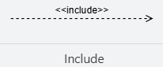
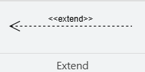
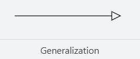
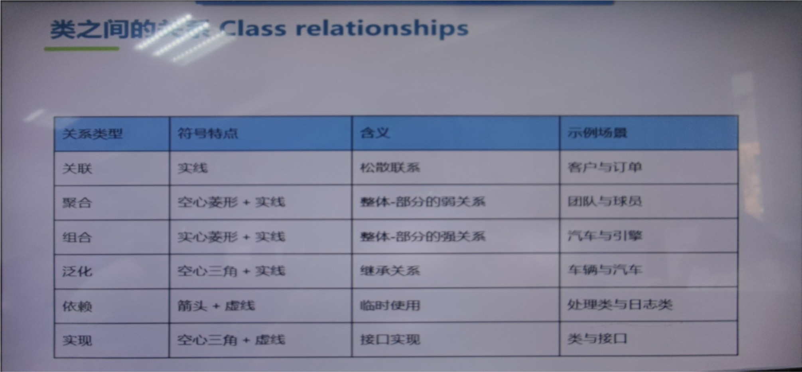
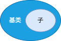
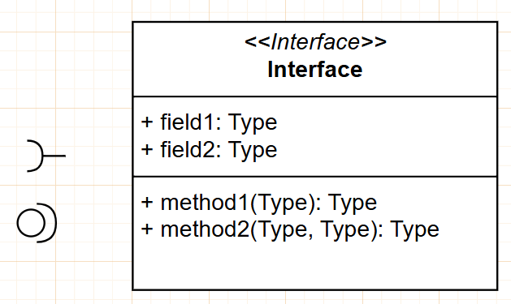

tags:
[TOC]

## 需求工程

### 用例规约

#### 1. 画出Use Case

#### 2. 编写用例规约

##### 1. 可选需求

##### 2. 非功能需求

##### 3. 黑盒用例规约 和 白盒用例规约

- 随着开发的过程要不断添加细节
  - 1.识别用例：有哪些时间、actor
  - 2.用例分布提纲：+前置条件 +后置条件
  - 3.（非技术甲方）黑盒规约：+完整的事件流
  - 4.（技术人员）白盒规约：+系统内部行为的细节描述
- 可以采用双列（用户视图 | 系统视图）

#### 3. 用例图优化

- 符号：
  - Include包含
    - 从基本用例→包含用例，包含用例为基本用例提供功能
    - <>衍型
  - Extend扩展
  - Generalization泛化（类似类中的继承关系）
- Include关系
  - 基数
  - Include中，不需要处理条件，
  - 分离非主要行为，突出用例的核心价值
  - 提出多个用例存在一段共有的行为，可以提取出来反复使用
- Extend关系（见图）
  - Extension扩展用例——Base基本用例
  - 基数
  - 扩展关系符号是
- Generalization泛化，

#### 建立概念模型Conceptual Class

##### 识别Conceptual Class

- 分类法
  - 物理实体
  - 逻辑实体
  - 组织实体
- 名词提取法
  - 1.从规约中提取所有名词，可重复
  - 2.去掉：冗余、执行者和系统本身、边界类（菜单、链接）、类的属性
  - 3.得到基本概念类
  - 易错：类的实体当做属性被删掉（e.g.型号）
    - 属性特征：数字，文本
    - 因此如果一个东西不能简单用数字或文本描述，应该为类而非属性

##### 建立Conceptual Class之间的关系

- 类图：类 + 类之间的关系
- 类是结构，结构是**静态**的
- UML
  - 类名 | 属性 | 操作
  - 可见性Visibility
    - +公共可见性
    - #受保护
    - -私有
    - ~包可见
  - 多重性Multiplicity
    - 描述关联
      - *无限多个
      - 1， 2， 0， 正好1，2，0个
      - {1 or 2...4}离散值
    - vs
      - 基数：整个关系
      - 多重性：某一端，“从这边看过去，能连几个那边”
  - 关联关系Relationship：Association
    - “一个类知道另一个类”
      - 无箭头实线：彼此都知道
        - ↑耦合性
        - 但更灵活
      - 单向实线：A知道B，A→B，订单→支付方式
        - 符合封装原则，↓耦合
        - 但导航性可能会比较麻烦，比如反向查询不方便
          - 导航性：一个类能否通过关联访问另一个类
            - 决定哪个类负责持有或访问数据
    - 需求分析阶段
    - 设计阶段
  - 聚合关系Relationship：Aggregation
    - 整体-部分
    - 空菱形实线箭头，菱形在整体
  - 组合关系Relationship：Composition
    - 生命周期，部分和组合一起消亡，强关联
    - 实菱形实线箭头
  - 泛化关系Relationship：Generalization
    - 空心实线箭头，空心箭头在父类
    - 尽量避免用多重继承
      - 重复继承问题，`“钻石问题”`
    - 优化：
      - Liskov替换准则LSP
      - 继承是is a kind of关系，即子类应该能替换基类型
      - 区分：泛化 vs 聚合
        - 带滚动条的窗口
          - 带滚动条的窗口 是 窗口；带滚动条的窗口 包含了 滚动条
  - 依赖关系Relationship：Dependency
    - 虚线带箭头，依赖类型<<自定义>>
  - 接口
    - 一组操作的集合（不包含属性）
    - 表示方法
      - <>
      - 圆圈表示
    - 分类
      - 供给接口
        - 提供的服务
        - 圆圈
      - 需求接口
        - 需要得到的服务
        - 半圆
  - 增加属性，类的属性（先）比操作（后）更重要
  - 状态机图
    - 类的行为性特征
    - 分类
      - 行为状态机
        - 内部
      - 协议状态机
        - 外部
    - 核心元素
      - 初始状态：实心圆⚫
      - 终止状态：圆圈包围⚫
      - 其他状态：圆角矩形，内部显示状态名
      - 状态转移：
        - 箭头
      - 事件：状态机中事件触发迁移
        - 转移上的标号表示
      - entry-do-exit-event？
    - 为什么要用状态机图
      - 1.对象的职责或行为变化显著
      - 2.系统或对象的用例涉及复杂的逻辑，且这些逻辑由状态驱动时
      - ×：
        - 对象的逻辑简单明了，不需要额外的状态机抽象
        - 对象的行为不依赖状态变化
        - 对象单一状态
        - 总结：不存在复杂的状态变化

#### 用例实现UCR

####

- 需求和设计之间的桥梁
- 用例中的每一个用力，在分析模型和设计模型中至少有一个用例实现与对应
- 分类
  - 动态交互图
  - 类图，静态视图

##### 识别分析类

- 分析类：描述每个角色的职责
- 设计阶段：角色赋与台词和动作，变成实际的系统组件
- 分析类：
  - 平台无关模型，与实现无关（可能做不出来）
  - MVC模型-视图-控制器
    - 实体类
      - 描述存储的信息，及信息相关的行为
      - 反映逻辑数据结构
      - 实体类不是某个用力实现所特有的
      - 识别：名词过滤
    - 边界类
      - 分类
        - 用户界面类
        - 系统接口类
        - 设备接口类
      - 识别规则actor和用例之间的一条通信关联对应一个边界类，actor是什么类型对应对应的边界类
    - 控制类
      - 每一个用例一定会有一个控制类
      - 关注流程逻辑，是事件流的抽象

#### 构建分析模型

- 交互图
  - 顺序图/时序图
    - 描述对象之间发送信息的时间顺序显示多个对象之间的动态协作
    - 垂直：时间
    - 水平：角色
      - 垂直：生命线
      - 生命线之间的箭头连线为消息
        - 同步消息：实心三角
        - 异步消息：带开放箭头的实线
        - 返回消息：带开放箭头的虚线
        - 创建消息：实线箭头指向新对象的头部
        - 销毁消息：生命线 + ×
        - 自调用消息：从生命线触发，绕回同一生命线
        - 匿名消息（不推荐）
        - 激活条，长度有讲究
    - 一般没有编号
    - fragment补充序列片段
      - 用于简化序列片段
      - 四种：
        - 1.ref标签
          - 复用已经定义好的交互场景
        - 2.loop标签
          - 由条件[get next item]控制执行
          - loop
        - 3.alt标签
          - 多个分支，条件执行
          - 只有一个分支被执行
            - 若多个为真，按情况选择执行那个分支（1st/随机）
        - 4.par标签
          - 并发
        - 5.opt标签
          - 选择执行，类似if

  - 通信图
    - 所有信息需要编号，以表示时间前后
    - 顺序图和通信图可以相互转换

  - VOPC类图（View Of Participating Class）
    - “用例实现”中的类图
      - 方法就是通信图中的消息

  - 改进类图：确定分析类的职责
    - 确定分析类的职责
      - 基本步骤：
        - 1.提取交互图的消息，识别发送者和接收者
        - 2.映射职责。专门的文档，说明职责来自哪个类，在消息图中名称，对应类里的哪个方法名等
    - 确定分析类的属性
      - 1.名词法识别的非实体的名词就是属性
      - 2.一般比较简单的数据类型，e.g.字符串、整型、数值型
      - 3.添加说明（可选）
    - 先定职责，再定属性

#### 完成用例分析

- 

### 前景文档Vision

### SRS文档

- 主要看用例
- 语境图
  - 外部实体有哪些？

### 需求验证

#### 原型确认

- 水平原型
  - 需求开发
- 垂直原型
  - 设计验证

#### 需求评审

- 四个阶段：计划——实施——改进——结束
  - 计划
    - 确定需求评审人员
    - 确定需求评审方法
      - 审查【正式评审】
      - 小组评审【轻式审查】
      - 走查【非正式】
      - 结对编程
        - 一个小时换一次
      - 同级桌查
        - 作者不知道评审者如何完成任务
      - 轮查
        - 多人的同级桌查
      - 临时评审
  - 选择
    - 风险高，用更正式的评审方式；反之可用评审低的
  - 实施
    - 对审查和小组评审等正式评审
  - 改进
- 输入
  - 待评审的需求文档
  - checklist

### 需求管理

-
  1. 获取
  2. 分析
  3. 定义
  4. 验证
- 主要活动
  - 需求优先级和需求基线
  - 需求变更控制和版本控制
    - 尽量使用需求变更控制工具，如Rational RequisitePro
  - 需求跟踪
    - 需求跟踪链
    - 需求跟踪矩阵（RTM）
- 需求工程工具
  - 分析建模工具
  - 需求管理与追踪工具

## 软件架构设计

- 软件设计模型
  - PSM（平台相关模型），需要考虑平台依赖
  - 分析模型和设计模型同时一边做一遍修改
  - 主要目标
    - ①实现所有明确的和隐含的需求
    - ②易读和易理解
    - ③提供软件的全貌，从实现的角度说明数据域、功能域和行为域
  - 类型
    - 数据模型
      - 面向过程：ER图、DD
      - OO：类图、类关系
    - 功能模型
      - 面向过程：DFD数据流图
      - OO：用例图
    - 行为模型
      - 面向过程：状态变迁图STD
      - OO：活动图、顺序图、状态图

- 软件设计过程
  - 确定软件架构
    - 合适的架构风格
    - 从逻辑、物理、进程等多个视图建立架构模型
    - 软件质量属性的设计策略，使软件系统在架构层面满足功能性和非功能性需求
  - 详细设计，细化每个模块

- 软件设计的原则
  - 抽象
    - 数据抽象
    - 过程抽象
    - 对象抽象
  - 分解和模块化
    - 模块
      - 外部特征
      - 内部特征
  - 封装和信息隐藏
  - 高内聚和低耦合
  - 软件设计质量
    - 7种软件设计的坏味道
      - 1、僵化性（Rigidity）：耦合性太高
      - 2、脆弱性（Fragility）：改动一个地方导致其他看似无关部分的崩溃，封装性差
      - 3、牢固性（Immobility）：系统难以复用，模块过于特定化（与环境的耦合程度太深）
      - 4、粘滞性（Viscosity）：做正确的事情很难，做错误的事情很简单
        - 软件~
        - 环境~
      - 5、不必要的复杂性（Needless Complexity）：
        - 为了未来可能需要而添加的抽象层
      - 6、不必要的重复（Needless Repetition）:
      - 7、晦涩性（Opacity）
      - 导致：难以理解、难以变更、难以复用、难以维护

- 软件设计的复用
  - GoF设计模式
  - 架构风格：复用整个系统架构，粒度最大
  - 设计模式：复用模块设计方案，粒度中等，适合功能模块或子系统
  - 编程惯用：复用代码实现，粒度最小，适合细节优化和语言特定场景
    - 团队的编码规范

## 软件架构

### 软件架构风格

- 分类
  - 通用风格
    - 分层
    - 管道
    - 黑板

#### 通用风格

##### 分层架构

特点：单向依赖，但也允许回调（非严格分层）

1. 常用：三层架构，为表示层、应用/业务逻辑层、数据层

2. 稍复杂：四层，表示层、服务层（Spring控制器，提供API）、业务逻辑层（Spring服务）、数据层

3. 复杂：五层，表示层、服务层（Spring控制器，提供API）、业务逻辑层（Spring服务）、数据访问层（Spring Data JPA Repository）、数据层

- 数据访问逻辑复杂，大型分布式系统或微服务框架

4. 更复杂：六层，表示层、控制层、服务层（Spring控制器，提供API）、领域层、数据访问层（Spring Data JPA Repository）、数据层

- 企业级的应用

优点：简单易懂，结构清晰，适合复用和单元化测试
缺点：

- 多层调用增加性能开销，出现在高并发场景
- 用户受限于用户接口，无法进行更细粒度的操作
- 分层质量受抽象影响
- 扩展性有限
  - 分层架构通常是一个单体架构，通常运行在一个进程或服务器上，只能整体部署，导致难以分布或频繁横向扩展（分担负载）

分层架构与多层架构（multi-tier）：

- 多层架构，物理分离，分布式部署

##### 管道与过滤器

一系列组件，过滤器负责处理数据，管道负责将输出传递到下一个过滤器的输入，数据流？

##### 黑板

适用：复杂、需要**协作**的问题。模拟人类专家围绕黑板解决问题。

黑板、知识源、控制器

- 黑板
- 知识源：仅与黑板交互，观察自己能否做出贡献
- 控制器：由黑板状态启动
  - 通知知识源黑板状态更新

缺点：

- 知识源集中访问黑板，可能性能瓶颈
- 调试比较困难，因为交互式动态的
  
应用：

- 语音识别：
  - 黑板：共享数据结构
  - 知识源：声学分析模块、语言理解模块、上下文理解模块、发音矫正模块
  - 控制器：监控黑板上的数据状态，决定哪个知识源执行下一步工作

#### 分布式架构风格

BS
三层架构
微服务架构
服务器无感知架构
云边端融合

##### C/S

客户端提供本地服务，服务器端进行计算

胖、瘦、智能。数据处理主要在哪一端

##### 三层架构

##### 服务与微服务风格

服务消费者

服务注册中心

服务提供者

1. 重型：面向服务架构SOA

- 多个功能
- 共享数据库
- 依赖中心化，必须要服务注册中心

2. 轻型：微服务 micoroservices.io

- 一个微服务仅提供一个功能
- 数据库隔离
- 去中心化，服务独立部署（便于扩展）
- 通过API网关进行路由

Spring Cloud 微服务开发相关组件

容器：
- 解决管理上难以跟踪服务器运行在哪台主机上
- docker

微服务镜像构建及实例创建

##### 服务无感知架构

服务本身不维护状态

函数式服务，由事件驱动，根据自变量的值产生因变量的值？？？

缺点：

- 冷启动
- 状态管理复杂
- 不适合长运行任务，e.g.Serverless函数由执行限制
- 对平台依赖性强

##### 云边端融合架构

云：核心网中具有高可扩展的强大算力的计算中心

边缘：在移动网络边缘

端：移动终端

移动端不断地产生数据，可以由选择地将数据发送给边缘服务器。
？？？

优点：

- 近数处理
- 节省网络带宽
- 提高系统可靠性

#### 交互式系统架构风格

MVC
PAC

##### MVC

Spring MVC

Django MVT

##### PAC

由智能体构成的结构层次

#### 反馈控制架构

- 批处理架构
- 解释器架构。仿真
- 事件驱动架构
  - Agent
  - Channel
- 进程控制架构

### 软件架构多视图的设计

- 4+1架构视图
  - 逻辑视图（静）
  - 进程视图（动）
  - 物理视图（动）
  - 开发视图（静）
  - 场景视图（联）
