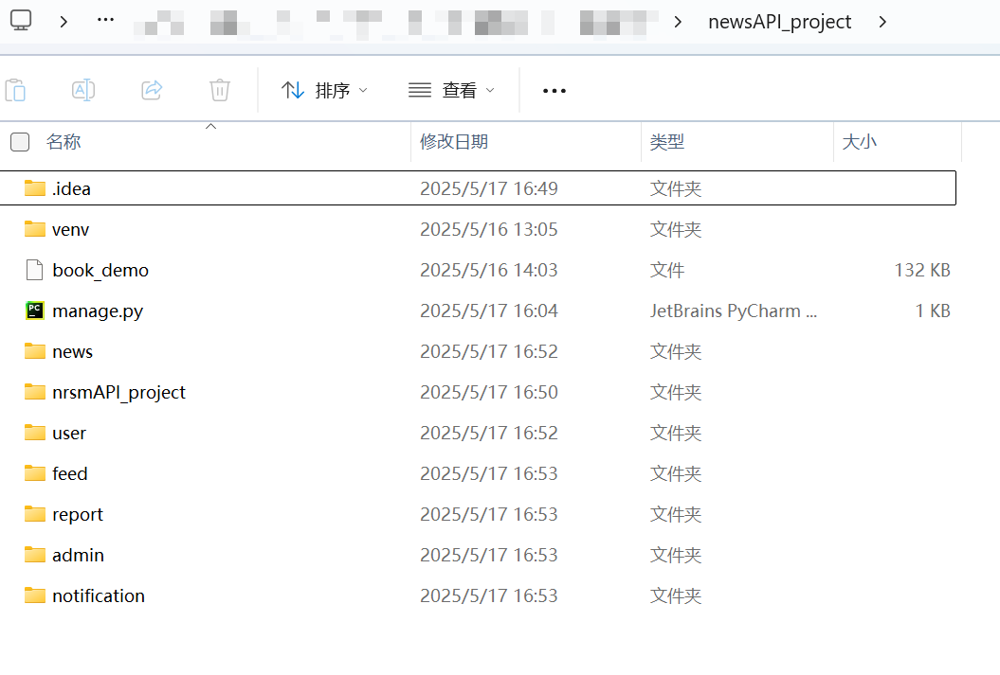
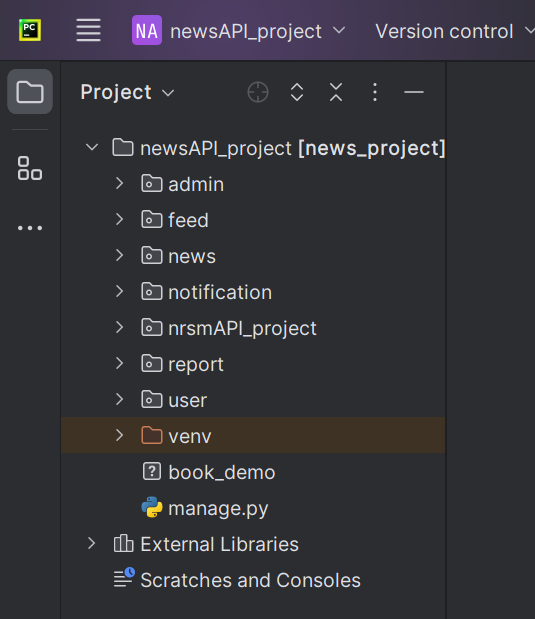
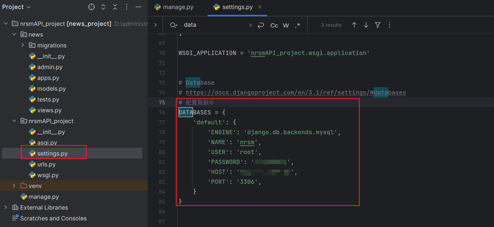
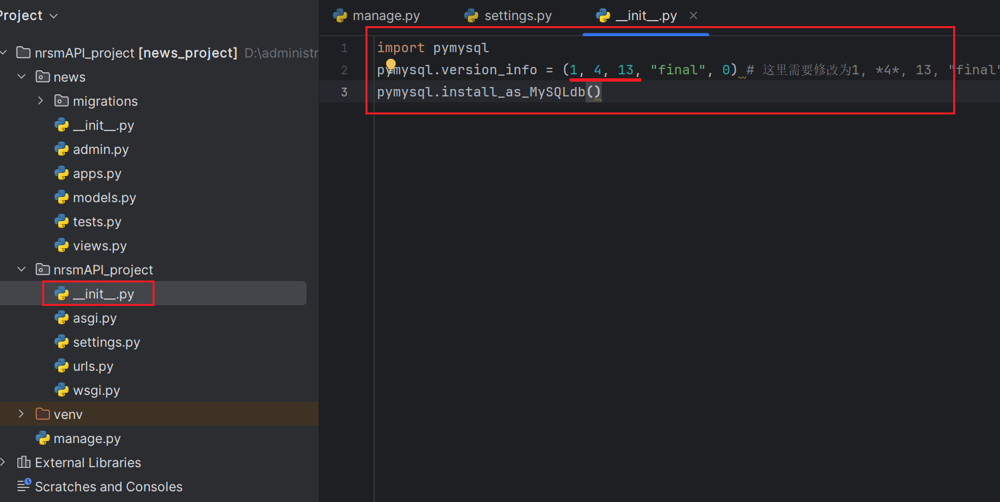
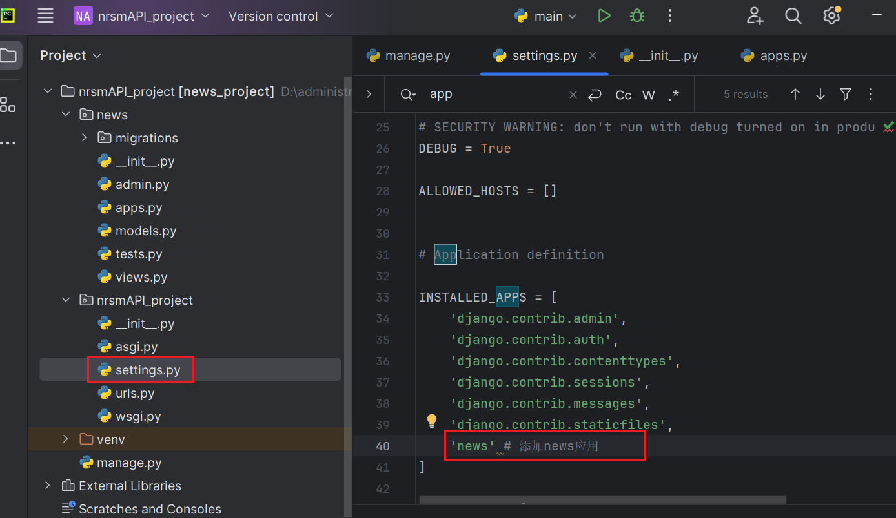

> 在前面已经跑通book_project的基础上，针对本项目的服务需求进行修改和完善。

## 一、Django结构

### 1.1 创建新Django项目

```bash
django-admin startproject nrsm_project
cd nrsm_project
python manage.py startapp news
python manage.py startapp user
python manage.py startapp admin_panel
```

~~再将之前book_project的`虚拟环境venv`和`.idea`文件复制过来，就不用重新配置虚拟环境了。~~——这样会出现路径仍然指向book_project，因此后面直接在把代码搬到book_project中了（搬人不搬屋）



项目结构如下



### 1.2 更改setting配置

#### 1.2.1 配置数据库

> 使用MYSQL



下面和参考教程不一样，在之前的项目测试中，改为1,4,13才能运行，具体原因暂按下不管。



#### 1.2.2 添加应用

将创建的app加入到installed_apps里面



#### 1.2.3 创建model


---

先到这一步吧，接下来是接口相关

---

#### 1.2.4 接口

先下载

```bash
pip install djangorestframework

pip install djangorestframework-simplejwt
```

在 settings.py 中添加

```python
INSTALLED_APPS  += [
    'rest_framework',
    'rest_framework_simplejwt',
]
```
