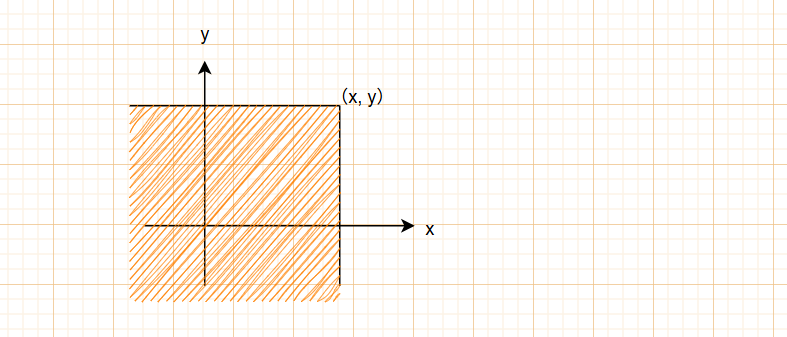
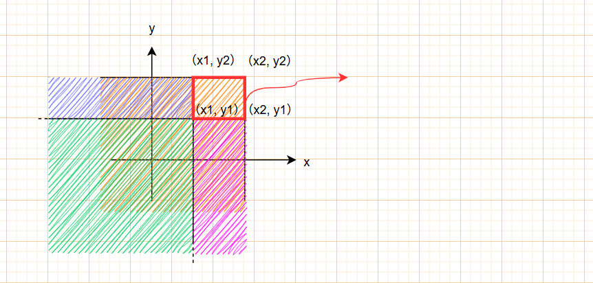
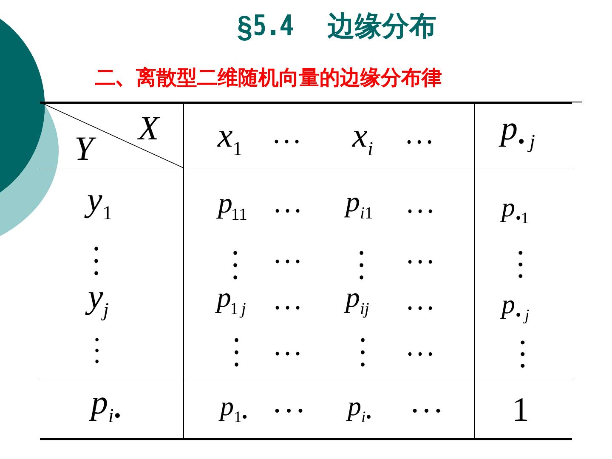

## 第3章 随机向量

<!--more-->

## 3.1 随机向量的分布

### 一、随机向量分布及其分布函数

####

- 出发点：一个事件的发生的概率受多种因素的共同作用。

- 【定义3.1】
  n维随机向量$$(X_1, X_2, X_3, ...)∈(\Omega, P)$$，则称$(X_1, X_2, X_3, ...)$是在$(\Omega, P)$上的一个随机向量。

- 【定义3.2】
  n维随机向量的分布函数$$F(x_1, x_2, ..., x_n)=P(X_1\leq x_1, X_2 \leq x_2, ..., X_n \leq x_n)$$，又称为n个随机变量的联合分布函数，它表示的是${X_1\leq x_1}, {X_2\leq x_2},..., {X_n\leq x_n}$的交事件

- 对于二维向量，其几何意义是：在平面上围成的面积

#### 随机向量分布函数的性质

以下仅对二维向量作讨论

1. $$P\{x_1 \leq X \le x_2, y_1 \le Y \le y_2\} \\ = F(x_2, y_2) - F(x_1, y_2) - F(x_2, y_1) + F(x_1, y_1)$$
2. 非负性
3. 单调非降，右连续
4. $$F(x, -\infty) = 0 \\ F(-\infty, y) = 0 \\ F(-\infty, -\infty) = 0 \\ F(+\infty, +\infty) = 1$$
5. 边缘分布函数 $$F(x, +\infty) = F_X(x) \\ F(+\infty, y) = F_Y(y)$$

### 二、离散型随机向量的概率分布

- 【定义3.4】
离散型随机向量$(X, Y)$的概率分布，或$X$和$Y$的联合分布，写作
  $$P\{X = x_i, Y = y_i\} = p_{ij}, i, j = 1, 2, ...,$$
- 性质
  - 非负性
  - 归一性
- 边缘分布
  $$p_{i}^X(i = 1, 2, ...) = \sum_j P\{X = x_i, Y = y_j\} = \sum_j p_{ij}\\p_{j}^Y(j = 1, 2, ...)同理$$
  - 求$X = x_1$的边缘密度函数，就把所有$y$的取值加起来（用$·$表示all）
  - 
  - $X$

### 三、连续型随机向量的概率密度函数

### 四、二元正态分布

## 3.2 条件分布与随机变量的独立性

### 一、条件分布与独立性的一般概念

### 二、离散型随机变量的条件概率分布与独立性

### 三、连续型随机变量的条件密度函数与独立性

## 3.3 随机向量的函数分布与数学期望

### 一、离散型随机向量的函数的分布

- 【离散型随机向量函数的定义】
设$Z = g(X, Y)$，则$$P\{Z = z_k\} = P\{g(X, Y) = z_k\} \\ = \sum_{g(x_i, y_j) = z_k}P\{X = x_i, Y = y_j\}, k = 1, 2, \dots$$

- 【结论】
设$X$,$Y$为两个**相互独立**的随机变量，且$X \sim P(\lambda_1)$，$Y \sim P(\lambda_2)$，则$$\xi = X + Y 服从参数为\lambda_1 + \lambda_2的泊松分布$$

### 二、连续型随机向量的函数的分布

- ==老师不要求计算==
- 【结论：正态分布的再生性】
$X$, $Y$ 相互独立且分别服从正态分布 $N \sim (\mu_1, \sigma_1^2)$，$N \sim (\mu_2, \sigma_2^2)$，则任意非零线性组合仍服从正态分布，且$$aX + bY \sim N(a\mu + b\mu, a^2\sigma_1^2 + b^2\sigma_2^2 )$$

### 三、随机向量的函数的数学期望

- 【离散型随机向量函数的数学期望定义】
离散型函数 × 对应的X,Y的联合概率，即
$$EZ = Eg(X, Y) = \sum_{i, j}g(x_i, y_j)p_{ij}$$

- 【连续型随机向量函数的数学期望定义】
连续型函数 × 密度函数，对X,Y的二重积分
$$EZ = Eg(X, Y) = \int_{-\infty}^{+\infty}\int_{-\infty}^{+\infty}g(x_i, y_j)f(x, y)dxdy$$

### 四、数学期望的进一步性质

- 记结论
  - 【结论1】$X$, $Y$ 的数学期望存在，则$E(X+Y)$存在，且
  $$E(X+Y) = EX + EY$$
  - 【结论2】$X$, $Y$**相互独立**，数学期望存在，则$E(XY)$存在，且
  $$E(XY) = EX EY$$
- 以上结论可推而广之到多个变量
